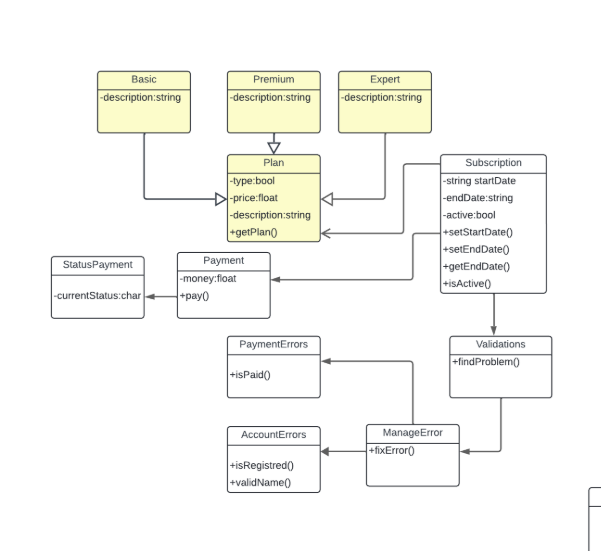

  

# Universidad Peruana de Ciencias Aplicadas

## Carrera de Ingeniería de Software

**Ciclo:** 2025 - 1  
**Curso:** Diseño de Experimentos de Ingeniería de Software - 1ASI0732  
**Sección:** 4429  
**Docente:** Ivan Robles Fernández 

**Startup:** VisionTech  
**Producto:** VehiTunning

| Código      | Nombre                           |
|-------------|----------------------------------|
| U202212112  | Luis Sebastian Chinchihualpa Saldarriaga   |
| U  | Franky Oswald Mallma Espiritu   |
| U20211G671  | Britney Delhy Qqueso Rodriguez   |

**Abril - 2025**

# **Registro de Versiones**

<table>
  <thead>
    <tr>
        <th>Versión</th>
        <th>Fecha</th>
        <th>Autor</th>
        <th>Descripción de modificación</th>
    </tr>
  </thead>
  <tbody>
  <tr>
      <td><strong>TB1</strong></td>
      <td>Abril</td>
      <td>
        <ul>
          <li>Luis Chinchihualpa</li>
          <li>Franky Mallma</li>
          <li>Britney Qqueso</li>
        </ul>
      </td>
      <td>
        Se han incluído los siguientes capítulos:
        <ul>
          <li>Capítulo I: Introducción</li>
          <li>Capítulo II: Requirements Elicitation & Analysis</li>
          <li>Capítulo III: Requirements Specification</li>
          <li>Capítulo IV: Product Design</li>
          <li>Avance del Capítulo V: Software Configuration Managemen y Product Implementation & Deployment.</li>
          <li>Avance de Conclusiones, Bibliografía y Anexos</li>
        </ul>
      </td>
  </tr>
  </tbody>
</table>

# **Student Outcomes**
<table style="border-collapse: collapse; width: 100%; border: 1px solid black;">
  <thead>
    <tr style="border-bottom: 1px solid black;">
      <th style="border-right: 1px solid black;">Criterio Específico</th>
      <th style="border-right: 1px solid black;">Acciones Realizadas</th>
      <th>Conclusiones</th>
    </tr>
  </thead>
    <tbody>
    <tr style="border-bottom: 1px solid black;">
      <td style="border-right: 1px solid black;"><strong>4.c.1 Reconoce responsabilidad ética y profesional en situaciones de ingeniería de software</strong></td>
      <td style="border-right: 1px solid black;">
<strong>TB1</strong>
</td>
      <td></td>
     </tr>
     <tr style="border-bottom: 1px solid black;">
      <td style="border-right: 1px solid black;"><strong>4.c.2 Emite juicios informados considerando el impacto de las soluciones de ingeniería de software en contextos globales, económicos, ambientales y sociales</strong></td>
      <td style="border-right: 1px solid black;">
<strong>TB1</strong>
</td>
      <td></td>
     </tr>
  </tbody>
</table>

# **Project Report Online**

URL Project Report (Github): 

# Capítulo I: Introducción

## 1.1 Startup Profile
### 1.1.1 Descripción de la Startup
VisionTech es una startup creada por estudiantes de la Facultad de Ingeniería de la Universidad Peruana de Ciencias Aplicadas (UPC), con la motivación de transformar la experiencia de personalización automotriz. Nace con el compromiso de solucionar las principales barreras que enfrentan los entusiastas de los autos al personalizar sus vehículos, como la falta de orientación profesional, la escasa variedad de servicios, precios poco accesibles y una limitada transparencia en el proceso.

A través de nuestra plataforma VehiTunning, ofrecemos un ecosistema digital completo que conecta a usuarios con proveedores certificados, facilitando decisiones informadas mediante cotizaciones automatizadas, comparativas inteligentes y asesoramiento especializado. Contamos con un equipo apasionado por la innovación tecnológica y la ingeniería de calidad, que trabaja incansablemente para garantizar una experiencia de personalización única, accesible y completamente centrada en las expectativas de cada usuario.

**Misión:**  
Facilitar la personalización automotriz a través de una plataforma digital accesible, inteligente y transparente, que brinde a los usuarios atención personalizada, precios justos y asesoramiento técnico especializado.

**Visión:**  
Convertirnos en referentes globales en innovación para la personalización automotriz, siendo reconocidos por nuestra transparencia, calidad técnica y compromiso con una experiencia de usuario extraordinaria que combine tecnología de vanguardia y atención personalizada.

### 1.1.2 Perfiles de integrantes del equipo

|  Nombres y Apellidos |    Codigo   | Descripción | Foto | 
|----------------------|-------------|-------------|------|
|   |     |     |     |    |
| Luis Sebastian Chinchihualpa Saldarriaga |  U.......  | descripcion de cada uno |      |
| Franky Oswald Mallma Espiritu |  U..... | descripcion de cada uno |     |
| Britney Delhy Qqueso Rodriguez | U20211G671 | Soy estudiante de la carrera de Ingeniería de Software en la Universidad Peruana de Ciencias Aplicadas (UPC). Me considero una persona autodidacta, dedicada, creativa y responsable. Cuento con experiencia en liderazgo y trabajo en equipo, y disfruto aprendiendo tanto de las personas como de las tecnologías con las que colaboro. Poseo conocimientos en diversos lenguajes de programación, como Python, HTML, CSS, JavaScript, entre otros. |     |

## 1.2 Solution Profile
### 1.2.1 Antecedentes y problemática
#### What
**¿Cuál es el problema?**  
En la actualidad, el sector de personalización automotriz enfrenta una falta alarmante de transparencia y un auge de prácticas poco éticas por parte de talleres y vendedores de accesorios. Esta situación genera desinformación entre los entusiastas del tuning, quienes no cuentan con el conocimiento necesario para diferenciar entre servicios auténticos y engañosos. Como resultado, muchos terminan tomando decisiones equivocadas, adquiriendo productos de baja calidad o pagando precios injustificados.

**¿Cuál es la relación con la persona en cuestión?**  
El usuario final es un entusiasta automotriz que busca personalizar su vehículo pero se enfrenta a un mercado desorganizado, con presupuestos opacos y sin asesoramiento técnico confiable. VehiTunning se posiciona como una solución que centraliza la información, asesora al usuario y garantiza precios justos y procesos transparentes.

#### When
**¿Cuándo sucede el problema?**  
El problema se presenta durante el proceso de personalización de un vehículo, al cotizar accesorios, realizar modificaciones estéticas o técnicas, o al elegir servicios especializados. La falta de referencias claras y profesionales capacitados expone a los consumidores a engaños frecuentes.

**¿Cuándo utiliza el cliente el producto?**  
El cliente accede a VehiTunning antes, durante y después de la personalización de su vehículo: para explorar opciones, comparar precios, recibir asesoría experta, seleccionar proveedores verificados y monitorear el proceso en tiempo real.

#### Where
**¿Dónde está el cliente cuando utiliza el producto?**  
Los usuarios pueden utilizar VehiTunning desde sus hogares, talleres mecánicos o concesionarios, accediendo desde computadoras, smartphones o tablets.

**¿Dónde surge el problema?**  
El problema se origina en talleres físicos, tiendas de accesorios y plataformas en línea que operan sin regulaciones claras ni controles de calidad, lo cual permite la existencia de estafas, sobreprecios y desinformación.

#### Who
**¿Quiénes están involucrados?**  
Clientes apasionados por los automóviles, técnicos mecánicos, proveedores de repuestos y servicios, talleres de modificación y plataformas digitales de venta.

**¿A quiénes les sucede el problema?**  
A los consumidores interesados en modificar o mejorar sus vehículos, que frecuentemente son víctimas de presupuestos inflados, componentes de dudosa procedencia o instalaciones deficientes.

**¿Quién lo utiliza?**  
VehiTunning está diseñado para ser utilizado por clientes finales, pero también por talleres aliados que deseen integrarse a un ecosistema más ético y transparente, promoviendo la confianza y la profesionalización del rubro.

#### Why
**¿Cuál es la causa del problema?**  
La raíz del problema radica en la falta de regulación del mercado y en la escasa disponibilidad de herramientas confiables que permitan comparar opciones, verificar reputaciones o acceder a asesoría especializada. Esto propicia un entorno propenso al abuso y la desinformación.

#### How
**¿En qué condiciones nuestros clientes usan el producto?**  
En contextos urbanos, de alto tráfico automotor, donde existe una fuerte cultura del tuning pero con acceso limitado a información confiable. Los usuarios recurren a VehiTunning cuando desean asegurar una experiencia personalizada, segura y transparente.

**¿Cómo nos conocieron nuestros compradores?**  
A través de redes sociales, foros automotrices, alianzas con talleres certificados, recomendaciones entre usuarios y eventos de cultura tuning.

**Cómo prefieren nuestros consumidores acceder a nuestro producto?**  
Mediante una app intuitiva y una plataforma web responsive que ofrezca comparadores de precios, asistencia virtual personalizada y un sistema de calificaciones comunitarias.

**¿Qué llevó a la persona a esa situación?**  
La necesidad de personalizar su vehículo sin caer en sobrecostos ni fraudes, buscando además una experiencia acompañada, confiable y eficiente.

#### How Much
Según Peru21 (2023), el auge del comercio electrónico ha incrementado notablemente las estafas digitales. Se estima que el 4% de los afectados por fraudes online en el país ha perdido más de 5,000 soles, siendo el sector automotriz uno de los más golpeados. En Lima, numerosos consumidores han sido víctimas de sitios web falsos que ofrecen productos a precios atractivos, pero no entregan lo prometido. Estas prácticas minan la confianza del público y afectan gravemente la reputación del sector.

### 1.2.2 Lean UX Process
#### 1.2.2.1 Lean UX Problem Statements
Nuestro servicio de personalización automotriz busca ofrecer una experiencia óptima tanto para los clientes interesados en modificar sus vehículos como para el personal técnico especializado que ejecuta estas modificaciones. Sin embargo, hemos identificado un desafío importante que afecta la efectividad del servicio: la falta de claridad en la comunicación y la poca transparencia en los procesos dificultan que los clientes comprendan plenamente las opciones disponibles. Esta situación impacta negativamente en su nivel de satisfacción y limita el potencial comercial del servicio.

La experiencia actual revela que los usuarios enfrentan dificultades para explorar y entender las posibilidades de personalización, lo que los lleva a tomar decisiones poco informadas. A su vez, el personal técnico experimenta complicaciones para transmitir adecuadamente las alternativas, lo cual impide gestionar de forma eficiente las expectativas del cliente. Esta desconexión entre lo que los usuarios esperan y lo que el servicio puede ofrecer representa una brecha crítica que debemos cerrar.

¿Cómo podemos rediseñar nuestra experiencia de personalización automotriz para mejorar la satisfacción del cliente y maximizar las oportunidades de negocio, mediante una comunicación más clara, procesos más accesibles y una experiencia de usuario más fluida?

**Aspectos:**

* **Domain:** Personalización automotriz.

* **Customer Segments:** Clientes que buscan personalizar sus vehículos y personal técnico especializado en modificaciones automotrices.

* **Pain Points:** Los clientes tienen dificultades para comprender y elegir entre las opciones de personalización, lo que genera decisiones poco acertadas y menor satisfacción. El personal técnico no cuenta con herramientas adecuadas para comunicar eficazmente las posibilidades, lo que afecta la experiencia del cliente y reduce las oportunidades de negocio.

* **Gap:** Existe una desconexión entre las expectativas de los clientes y la capacidad del equipo técnico para ofrecer una experiencia alineada a estas.

* **Visión/Strategy:** Desarrollar una plataforma intuitiva y accesible que acompañe al cliente en el proceso de personalización, facilitando la toma de decisiones informadas y fomentando una comunicación transparente entre cliente y técnico.

#### 1.2.2.2 Lean UX Assumptions
**Assumptions**  
Los supuestos (assumptions) son fundamentales para identificar riesgos del proyecto y fomentar la participación activa del equipo mediante la expresión de ideas y perspectivas diversas.

**User Assumptions**   

**¿Quién es el usuario?**
Personas propietarias de vehículos interesadas en personalizar sus autos de forma segura, confiable y práctica.

**¿Dónde encaja nuestro producto en su vida?**
Nuestro producto se integra en su día a día, ofreciendo una solución accesible para personalizar vehículos sin riesgos de estafas, cumpliendo con sus expectativas y necesidades personales.

**¿Qué problemas resuelve?**
Elimina la falta de transparencia, reduce el riesgo de fraudes y simplifica el acceso a opciones de personalización confiables.

**¿Cuándo y cómo lo usan?**
Se utiliza cuando el usuario decide personalizar su auto, brindando una plataforma disponible en cualquier momento que facilite este proceso de manera segura y eficiente.

**¿Cómo debe lucir y funcionar?**
Debe contar con un diseño intuitivo y atractivo, con una navegación sencilla que guíe al usuario paso a paso. Además, debe ofrecer seguridad, confiabilidad y resultados satisfactorios.

**Business Assumptions**  

* Los usuarios necesitan una solución digital confiable y accesible que los proteja de estafas durante el proceso de personalización.
* Una app móvil intuitiva, segura y con procesos claros puede satisfacer esta necesidad.
* Nuestros clientes iniciales serán propietarios de vehículos que buscan un servicio seguro y sin complicaciones.
* El principal valor para los clientes es la seguridad y confianza al personalizar sus vehículos.
* Beneficios adicionales: variedad de opciones, asesoramiento profesional, precios transparentes y experiencia fluida.
* La adquisición de usuarios se realizará a través de marketing digital dirigido y alianzas con concesionarios y talleres especializados.
* El modelo de ingresos incluirá suscripciones, publicidad integrada y servicios premium. También se generarán ingresos mediante alianzas estratégicas con técnicos especializados.
* La competencia incluye apps similares, talleres físicos y tiendas especializadas.
* Nos destacaremos por nuestra atención a la seguridad, la transparencia, la diversidad de opciones y una experiencia de usuario superior.
* El principal riesgo es la desconfianza en la plataforma.
* Lo mitigamos mediante validaciones rigurosas de los técnicos, medidas de seguridad sólidas y una comunicación clara con los usuarios.

**Business Outcomes**    

* **Mayor retención de clientes:** Una experiencia segura y eficiente impulsará la lealtad del usuario y la recurrencia.
* **Reputación fortalecida:** Al cumplir las expectativas, mejoramos la imagen de marca y generamos mayor confianza en el mercado.
* **Incremento en ingresos:** Más usuarios satisfechos conducen a un mayor volumen de transacciones.
* **Mayor visibilidad:** Al ofrecer una solución efectiva y diferenciada, ganamos reconocimiento y captamos nuevos clientes.

**User Outcomes**  

* **Eficiencia mejorada:** Los usuarios personalizan sus vehículos más rápidamente, ahorrando tiempo y esfuerzo.
* **Decisiones informadas:** Acceso claro a opciones y detalles técnicos permite elegir con mayor seguridad.
* **Menor estrés:** La facilidad de uso reduce la frustración común en estos procesos.
* **Satisfacción elevada:** Al obtener el resultado esperado, se eleva la satisfacción tanto personal como con el servicio.

**Features**  

* **Gestión centralizada de información:** Plataforma unificada para acceder a datos clave de personalización, mantenimiento y desempeño de partes.
* **Paneles de control personalizables:** Visualización flexible de información adaptada a las preferencias del usuario.
* **Opciones de personalización del sistema:** Ajustes según tipo de vehículo y preferencias personales.
* **Herramientas de seguimiento:** Registro de modificaciones, progreso y análisis de tendencias para futuras decisiones de personalización.

#### 1.2.2.3 Lean UX Hypothesis Statements
**Creemos que** al ofrecer una plataforma centralizada e intuitiva para la gestión de la personalización vehicular, los usuarios podrán completar sus proyectos de forma más rápida y eficiente.  
**Sabremos que lo logramos cuando** los usuarios compartan comentarios positivos, el tiempo promedio para completar tareas de personalización se reduzca en un 30%, y la tasa de abandono de proyectos disminuya en un 40%.  

**Creemos que** al proporcionar información clara y detallada sobre las opciones disponibles, los usuarios podrán tomar decisiones mejor fundamentadas, alineadas con sus gustos y necesidades.  
**Sabremos que lo logramos por** medio de testimonios que indiquen que la plataforma facilitó sus decisiones, un incremento del 35% en la satisfacción con las personalizaciones elegidas, y un aumento del 40% en la conversión de exploración a compra.  

**Creemos que** al ofrecer una experiencia positiva y resolver eficazmente las necesidades del usuario, la plataforma ganará una mejor reputación y mayor credibilidad en el mercado.  
**Sabremos que lo logramos mediante** comentarios de clientes potenciales que reflejen confianza en la plataforma, un aumento del 40% en la tasa de conversión de leads, y una mejora del 25% en la satisfacción general del cliente.  

#### 1.2.2.4 Lean UX Canvas

## 1.3 Segmentos objetivo
**Segmento #1: Clientes que desean personalizar sus vehículos**  
Este segmento está compuesto por personas interesadas en mejorar y personalizar sus autos como una forma de expresión personal, estilo de vida y diferenciación. Buscan opciones innovadoras, asesoramiento especializado y experiencias que les permitan destacar con originalidad.

**Aspectos demográficos:**  
  * **Sexo:** Masculino y femenino
  * **Edades:** Entre 18 y 50 años
  * **Nivel socioeconómico:**
    *Profesionales con altos ingresos y empresarios
    *Ejecutivos, gerentes y profesionales con ingresos medio-altos
    *Jóvenes profesionales, emprendedores y trabajadores con ingresos medios

**Aspectos geográficos:**  
  * **Nacionalidad:** Peruana
  * **Ubicación:** Principalmente en zonas urbanas y suburbanas de Perú, como Lima Metropolitana, Arequipa, Trujillo, entre otras

**Aspectos psicográficos:**
  * **Motivaciones:** Expresar su personalidad a través del diseño del vehículo, destacar en su entorno social, disfrutar del proceso creativo y del asesoramiento experto
  * **Intereses:** Tecnología automotriz, diseño, estética, tendencias de customización, experiencias diferenciadas
  * **Comportamiento:** Buscan plataformas que simplifiquen el proceso de personalización, comparan alternativas, valoran la calidad, la innovación y la atención personalizada

**Segmento #2: Personal técnico y staff mecánico**  
Este segmento está conformado por técnicos automotrices, mecánicos e ingenieros que forman parte del ecosistema de personalización. Su rol es clave en la implementación de mejoras en los vehículos y están en constante búsqueda de herramientas, técnicas y conocimientos para optimizar su trabajo.

**Aspectos demográficos:**
  * **Sexo:** Mayoritariamente masculino, con creciente participación femenina
  * **Edades:** Entre 20 y 60 años
  * **Nivel socioeconómico:**
    *Ingenieros automotrices, técnicos especializados
    *Mecánicos con trayectoria y formación técnica sólida
    *Ayudantes de taller, aprendices

**Aspectos geográficos:**
  * **Nacionalidad:** Peruana
  * **Ubicación:** Zonas urbanas y suburbanas con alta densidad de talleres, como Lima, Callao, Arequipa, etc.

**Aspectos psicográficos:**
  * **Motivaciones:** Mejorar sus habilidades, brindar un mejor servicio, adaptarse a nuevas tecnologías, ser reconocidos por su experiencia
  * **Intereses:** Mecánica automotriz, herramientas digitales, actualización constante, aprendizaje técnico
  * **Comportamiento:** Participan en capacitaciones, valoran plataformas que faciliten su trabajo, buscan soluciones eficientes y colaborativas

# Capítulo II: Requirements Elicitation & Analysis

## 2.1 Competidores
### 2.1.1 Análisis competitivo
### 2.1.2 Estrategias y tácticas frente a competidores

## 2.2 Entrevistas
### 2.2.1 Diseño de entrevistas
### 2.2.2 Registro de entrevistas
### 2.2.3 Análisis de entrevistas

## 2.3 Needfinding
### 2.3.1 User Personas
### 2.3.2 User Task Matrix
### 2.3.3 User Journey Mapping
### 2.3.4 Empathy Mapping
### 2.3.5 As-is Scenario Mapping

## 2.4 Ubiquitous Language

# Capítulo III: Requirements Specification

## 3.1 To-Be Scenario Mapping
## 3.2 User Stories
## 3.3 Impact Mapping
## 3.4 Product Backlog

# Capítulo IV: Product Design

## 4.1 Style Guidelines
### 4.1.1 General Style Guidelines
**Branding:** 
Aunque en un principio optamos por la creación de un imagotipo, sentimos que saturaba la esencia de la aplicación, por lo que la final optamos por un diseño minimalista y moderno en representado en un logotipo con los colores representativos de nuestra marca.

**Tipografías:**

Para las tipografías optamos por usar 3 variaciones de roboto(regular, italic semibold, black) y 2 variaciones de Plus Jakarta Sans(light, regular).

**Colores:**

En cuanto a nuestra paleta de colores, esta consta únicamente de 2, los cuales son un azul(#5766F5) y un negro con un matiz claro(#595959).

**Margin:**

Se optó por hacer uso de margin de elementos pequeños: verticalmente: 24px, horizontalmente 32px y para elementos grandes: verticalmente: 24px, horizontalmente 48px.

**Responsive y breakpoints:**

Teniendo en cuenta que todos los diseños tienen que ser responsive nosotros optamos por definir los siguiente breakpoints, mimos que los podrias etiquetar como:

- sm: pantallas menores a 640px.
- lg: pantallas menores a 1024px.
- xl: pantallas menores a 1280px.

### 4.1.2 Web Style Guidelines
 **Enlace del figma: <https://www.figma.com/file/3puKCQI9HpY36ICGlYihgc/CarTunn-vFinal?type=design&node-id=224%3A2416&mode=design&t=w8OvXgMIblMERzsm-1>** 

   Como se mencionó anteriormente se buscó que la landing fuese mucho más limpia por lo que el navbar no tiene iconos y el margin de 40px entre elementos ul y li mejora la UI.

   Se tiene a su vez un section con algunas marcas de vehículos que ya hemos personalizado anteriormente, así como un article con algunas características acerca de nuestro producto.

   

En la sección de Costumers presentamos un article con las opiniones de algunos de nuestros clientes con los que ya hayamos trabajado.

Y finalmente se puede ver un article en la sección de pricing pues al trabajar dependiendo el vehículo, no existe un costo fijo pero se puede realizar una cotización. Sin olvidar otro article con información acerca de donde nos encontramos e información de contacto y el footer.

### 4.1.3. Mobile Style Guidelines.
Importante: la web está diseñada a su vez para ser responsive, con plena compatibilidad con Android y IOS.

### 4.1.3.1. iOS Mobile Style Guidelines.
En el diseño del mockup para dispositivos móviles IOS la diferencia principal yace en el margin bottom que se tuvo que dejar para respetar el safe area característico de este tipo de dispositivos

### 4.1.3.2. Android Mobile Style Guidelines.
En cuanto para dispositivos android este safe área es inexistente por lo que solo el diseño debe de respetar los principios grid y flexbox para el diseño responsive de la web. 

## 4.2 Information Architecture
### 4.2.1 Organization Systems
### 4.2.2 Labeling Systems
### 4.2.3 SEO Tags and Meta Tags
### 4.2.4 Searching Systems
### 4.2.5 Navigation Systems

## 4.3 Landing Page UI Design
### 4.3.1 Landing Page Wireframe
### 4.3.2 Landing Page Mock-up

## 4.4 Web Applications UX/UI Design
### 4.4.1 Web Applications Wireframes
### 4.4.2 Web Applications Wireflow Diagrams
### 4.4.3 Web Applications Mock-ups
### 4.4.4 Web Applications User Flow Diagrams

## 4.5 Web Applications Prototyping

## 4.6 Domain-Driven Software Architecture
### 4.6.1 Software Architecture Context Diagram
### 4.6.2 Software Architecture Container Diagrams
### 4.6.3 Software Architecture Components Diagrams

## 4.7 Software Object-Oriented Design
### 4.7.1 Class Diagrams
### 4.7.2 Class Dictionary

## 4.8 Database Design
### 4.8.1 Database Diagram

# Capítulo V: Product Implementation, Validation & Deployment

## 5.1 Software Configuration Management
### 5.1.1 Software Development Environment Configuration
### 5.1.2 Source Code Management
### 5.1.3 Source Code Style Guide & Conventions
### 5.1.4 Software Deployment Configuration

## 5.2 Landing Page, Services & Applications Implementation
### 5.2.1 Sprint 1
#### 5.2.1.1 Sprint Planning 1
#### 5.2.1.2 Sprint Backlog 1
#### 5.2.1.3 Development Evidence for Sprint Review
#### 5.2.1.4 Testing Suite Evidence for Sprint Review
#### 5.2.1.5 Execution Evidence for Sprint Review
#### 5.2.1.6 Services Documentation Evidence for Sprint Review
#### 5.2.1.7 Software Deployment Evidence for Sprint Review
#### 5.2.1.8 Team Collaboration Insights during Sprint

# Conclusiones
## Conclusiones y recomendaciones
## Video About-the-Team
# Bibliografía
# Anexos

4**Capítulo IV: Product UX/UI Design** 
   4.1. **Style Guidelines**
4.1.1. **General Style Guidelines**

**Branding:** 

Aunque en un principio optamos por la creación de un imagotipo, sentimos que saturaba la esencia de la aplicación, por lo que la final optamos por un diseño minimalista y moderno en representado en un logotipo con los colores representativos de nuestra marca.

**Tipografías:**

Para las tipografías optamos por usar 3 variaciones de roboto(regular, italic semibold, black) y 2 variaciones de Plus Jakarta Sans(light, regular).

**Colores:**

En cuanto a nuestra paleta de colores, esta consta únicamente de 2, los cuales son un azul(#5766F5) y un negro con un matiz claro(#595959).

**Margin:**

Se optó por hacer uso de margin de elementos pequeños: verticalmente: 24px, horizontalmente 32px y para elementos grandes: verticalmente: 24px, horizontalmente 48px.

**Responsive y breakpoints:**

Teniendo en cuenta que todos los diseños tienen que ser responsive nosotros optamos por definir los siguiente breakpoints, mimos que los podrias etiquetar como:

- sm: pantallas menores a 640px.
- lg: pantallas menores a 1024px.
- xl: pantallas menores a 1280px.

4.1.2**Web Style Guidelines.**

   **Enlace del figma: <https://www.figma.com/file/3puKCQI9HpY36ICGlYihgc/CarTunn-vFinal?type=design&node-id=224%3A2416&mode=design&t=w8OvXgMIblMERzsm-1>** 

   Como se mencionó anteriormente se buscó que la landing fuese mucho más limpia por lo que el navbar no tiene iconos y el margin de 40px entre elementos ul y li mejora la UI.

   Se tiene a su vez un section con algunas marcas de vehículos que ya hemos personalizado anteriormente, así como un article con algunas características acerca de nuestro producto.

   

En la sección de Costumers presentamos un article con las opiniones de algunos de nuestros clientes con los que ya hayamos trabajado.

Y finalmente se puede ver un article en la sección de pricing pues al trabajar dependiendo el vehículo, no existe un costo fijo pero se puede realizar una cotización. Sin olvidar otro article con información acerca de donde nos encontramos e información de contacto y el footer.

4.1.3**Mobile Style Guidelines.**

   Importante: la web está diseñada a su vez para ser responsive, con plena compatibilidad con Android y IOS.

4.1.1.1**iOS Mobile Style Guidelines.**

En el diseño del mockup para dispositivos móviles IOS la diferencia principal yace en el margin bottom que se tuvo que dejar para respetar el safe area característico de este tipo de dispositivos
4.1.1.2**Android Mobile Style Guidelines.**

En cuanto para dispositivos android este safe área es inexistente por lo que solo el diseño debe de respetar los principios grid y flexbox para el diseño responsive de la web. 

4.2.**Information Architecture.**
4.2.2. **Organization Systems.** 

En lo que concierne a la organización visual del contenido de nuestro proyecto, se aplicará el patrón visual hierarchy para organizar la información en las distintas secciones de la aplicación. Esto significa que la relevancia de las oraciones será determinada por el tamaño de la fuente, donde aquellas de mayor importancia se mostrarán con un tamaño de fuente de 48px (equivalente a 3rem), mientras que otras se presentarán con tamaños de fuente más pequeños. Además, se utilizará un formato de organización matricial ordenada para exhibir las características del producto, asegurando una presentación estructurada y fácil de seguir.

En cuanto a los métodos de categorización del contenido, se empleará la categorización basada en la audiencia, dado que nuestro proyecto tiene dos segmentos objetivos: clientes interesados en personalizar sus autos y staff mecánico. Cada segmento contará con secciones específicas y funciones adaptadas a sus necesidades particulares. Adicionalmente, se utilizará la categorización cronológica para el registro de entradas, especialmente cuando los usuarios accedan a bases de datos con información temporal. En este caso, las entradas más recientes tendrán prioridad y se mostrarán al principio para facilitar la visualización del contenido en orden temporal.

4.2.3**Labeling Systems.**

En el landing page, hemos optado por reducir el uso de iconos representativos en los enlaces y, en su lugar, dar prioridad al texto con botones destacados. Esto nos permite mantener la estética minimalista del landing page. Además, hemos incluido iconos de colores para identificar nuestras redes sociales y otros elementos.

En relación con nuestra aplicación, también hemos implementado botones de acceso rápido uno de muchos como a modo de call-to-action, para que los usuarios puedan ordenar accesorios de manera directa y sencilla.

4.2.4**SEO Tags and Meta Tags.** 

**Landing Page:** 

 <meta charset= UTF-8 >  

<meta http-equiv="X-UA-Compatible" content="IE=edge"> 

<meta name= "viewport" content="width=device-width, initial-scale=1.0"> 

<meta name="agriculture" content="index, follow"> 

<link rel="shortcut icon" href="\*./images/favicon.png" type="image/x-icon"/> 

<title>CarTunn</title> 

<meta name="keywords" content="cartunn, tunning, mechanical staff, report, Customization, orders, automotive customization , software, accessories, customization services"> 

<meta name="description" content="Start now customizing your car now, There are already dozens of car lovers who have trusted us, you be one more"> 

**Web Application:** 

<meta charset= UTF-8 > 

<meta http-equiv="X-UA-Compatible" content="IE=edge"> 

<meta name= "viewport" content="width=device-width, initial-scale=1.0"> 

<meta name="customization" content="index, follow"> 

<link rel="shortcut icon" href="\*./images/favicon.png" type="image/x-icon"/> 

<title>CarTunn</title> 

<meta name="keywords" content="CarTunn,CarTunn Log In, CarTunn Sing Up, CarTunn app, CarTunn register, customization software,"> 

<meta name="description" content="CarTunn Log In.Start now customizing your car now.Collaborative platform between mechanical staff and clients who want to customize their cars."> 

4.2.5. **Searching Systems.** 

En lo que respecta a los sistemas de búsqueda en nuestra aplicación, se implementará un sistema de filtros en los registros de entradas por fecha, lo que permitirá a los usuarios buscar y visualizar información según fechas específicas.

Además, se utilizarán filtros por pestañas en las siguientes ocasiones:

- Cuando el cliente, interesado en personalizar su automóvil, desee buscar sus procesos de personalización según su estado, como "en proceso" y "finalizado". Esto permitirá a los usuarios visualizar rápidamente el estado de sus solicitudes de personalización y realizar un seguimiento de su progreso.
- Cuando el staff mecánico revise, dentro de un proceso de personalización de vehículos, el estado de los vehículos en cada etapa, como "en revisión", "en proceso de instalación", "completado", entre otros según sea necesario. Esta función proporcionará una visión clara del progreso de cada proyecto de personalización y ayudará al personal mecánico a gestionar eficientemente las tareas pendientes.

4.2.6**Navigation Systems.**

   La estructura de navegación de nuestra aplicación se fundamentará en un componente de interfaz de usuario ampliamente utilizado: el sidebar. Este sidebar contendrá todas las opciones disponibles en la aplicación, organizadas de manera jerárquica. Es importante destacar que el contenido del sidebar variará según el tipo de usuario que acceda a la aplicación.

   

4.3**Landing Page UI Design.** 

En esta sección, presentamos nuestra propuesta de diseño de interfaz de usuario (UI) para el Landing Page. Explicamos cómo traducimos nuestras decisiones de diseño y arquitectura de información en una experiencia visualmente atractiva y funcional. El Landing Page es la primera impresión de nuestro sitio web, por lo que es crucial que refleje nuestra marca, comunique claramente nuestros mensajes clave y guíe a los usuarios hacia las acciones deseadas. Destacaremos los principios de diseño y consideraciones estratégicas que hemos utilizado para crear una experiencia de usuario efectiva y memorable.

4.3.1**Landing Page Wireframe.** 

**Enlace del figma web:** 

[**https://www.figma.com/file/mTtYszxtJt7r9ctlNzccEK/Wireframe-Landingpage?type=design&node-id=0%3A1&mode=design&t=SDb42Y1oTtVkd5Go-1](https://www.figma.com/file/mTtYszxtJt7r9ctlNzccEK/Wireframe-Landingpage?type=design&node-id=0%3A1&mode=design&t=SDb42Y1oTtVkd5Go-1)** 

**Enlace del figma móvil:**

[**https://www.figma.com/file/Ra8FhHb46JMhkNThyLmwbU/Mobile-wireframe?type=design&node-id=0%3A1&mode=design&t=4IPCw13uV4ZLjkE0-1](https://www.figma.com/file/Ra8FhHb46JMhkNThyLmwbU/Mobile-wireframe?type=design&node-id=0%3A1&mode=design&t=4IPCw13uV4ZLjkE0-1)** 

4.3.2**Landing Page Mock-up.**

   **Enlace del figma: <https://www.figma.com/file/3puKCQI9HpY36ICGlYihgc/CarTunn-vFinal?type=design&node-id=224%3A2416&mode=design&t=wOoV1LZs3RIcch1q-1>** 

   

   

4.4 **Mobile Applications UX/UI Design.** 
4.4.1**Mobile Applications Wireframes**

**Enlace de figma: <https://www.figma.com/design/9hoP2hiYV16lw0JxAVU4jb/Cartunn-Mobile-App-(Copy)?node-id=2036-4012&t=wN1wYS9ZHvzo8Klc-1>** 

Inicio de sesión

Registro de nueva cuenta

User goal: Aplicación para miembros de staff:

Detalle de orden

En caso de haber problemas en la modificación del vehículo, el staff manualmente puede cambiar la fecha de entrega del vehículo al cliente y este será notificado.

Ingresar observaciones

Ingreso de fechas

Ver estado de productos

Manejo de reembolsos

Subir item a la aplicacion

Actualizar item

Remover item por id

Notificar proveedores por id:

Centro de ayuda:

Configuraciones:

Deslogear (cerrar sesion)

4.4.2. **Mobile Applications Wireflow Diagrams**

   User goal : inicio de sesion

   

   User goal descripcion de producto:

   

   User goal: escribir observacion

   

   User goal: ingresar fecha de orden completado

   

   User goal: ver estado de productos

   

   User goal: manejar estado de reembolsos

   

   User goal: subir item a la aplicacion

   

   User goal: actualizar item en la aplicacion

   

   User goal: remover item en la aplicacion por id

   

   User goal: notificar proveedores por id

   

   User goal: notificar proveedores:

   

   User goal: centro de ayuda

   

User goal: cierre de sesion

4.4.3. **Mobile Applications Mock-ups**

   Enlace figma: <https://www.figma.com/design/9hoP2hiYV16lw0JxAVU4jb/Cartunn-Mobile-App-(Copy)?node-id=0-1&t=wN1wYS9ZHvzo8Klc-1> 

   User goal: El usuario se registra, restablece su contraseña o inicia sesión en la aplicación

   Inicio de sesión

   

   Registro de nueva cuenta

   

   User goal: Aplicación para miembros de staff:

   

   Detalle de orden

   

   En caso de haber problemas en la modificación del vehículo, el staff manualmente puede cambiar la fecha de entrega del vehículo al cliente y este será notificado.

Ingresar observaciones

Ingreso de fechas

Ver estado de productos

Manejo de reembolsos

Subir item a la aplicacion

Actualizar item

Remover item por id

Notificar proveedores por id:

Centro de ayuda:

Configuraciones:

Log-out (cerrar sesión)

4.4.4 **Mobile Applications User Flow Diagrams**

   User goal : inicio de sesión

   

   User goal descripción de producto:

   

   User goal: escribir observación

   

User goal: ingresar fecha de orden completado

User goal: ver estado de productos

User goal: manejar estado de reembolsos

User goal: subir item a la aplicación

User goal: actualizar item en la aplicación

User goal: remover item en la aplicación por id

User goal: notificar proveedores por id

User goal: centro de ayuda

User goal: configuraciones

User goal: cierre de sesión

4.5. **Mobile Applications Prototyping**
    4.5.1. **Android Mobile Applications Prototyping**

Para el desarrollo de esta sección de nuestro proyecto fue necesario usar la herramienta Prototype by Figma en la que pudimos realizar una simulación de como estaría construida nuestra aplicación.

**Enlace del video:**

[**upc-pre-202402-cc238-sw65-raidDev-prototyping.mp4**](https://1drv.ms/v/c/5b65fa3a62cd5975/ESjTTZfRMFZKh0nZv49CLYwB5oPoyt1KobtQZU2koInDMA?e=Yv3udb)

4.5.2. **IOS Mobile Applications Prototyping**

   **Enlace del video:**

[**upc-pre-202402-cc238-sw65-raidDev-prototyping.mp4**](https://1drv.ms/v/c/5b65fa3a62cd5975/ESjTTZfRMFZKh0nZv49CLYwB5oPoyt1KobtQZU2koInDMA?e=Yv3udb)

4.6. **Web Applications UX/UI Design.** 
   4.6.1. **Web Applications Wireframes.**
                                        User goal: El usuario se registra, restablece su contraseña o inicia sesión en la aplicación

   Inicio de sesión

 

Registro de nueva cuenta

Reestablecer la contraseña

Aplicación para clientes

User goal: Presentación del home de la aplicación

Descripción detallada del elemento automovilístico a ordenar para poder ser reemplazado por el antiguo 

Modal que muestra los elementos guardados como favoritos por el cliente

User goal: Status report del vehículo(muestra el estado de tuning en el que se encuentra el vehículo)

- In process: En proceso de tuning
- Finished: Modificación terminada

User goal: Notificaciones que llegarán al usuario inmediatamente al haber ordenado sus modificaciones indicando la fecha de entrega del vehículo 

User goal: Pasarela de pagos

User goal: Settings del perfil del usuario

User goal: apartado con las preguntas frecuentes

User goal: Aplicación para miembros de staff:

Modal para escribir una observación en caso de haberla por cada servicio de tuning.

En caso de haber problemas en la modificación del vehículo, el staff manualmente puede cambiar la fecha de entrega del vehículo al cliente y este será notificado.

Toogle manual que el staff puede modificar para indicar el estado en el que se encuentra el vehículo 

In process: En proceso de tuning

Finished: Modificación terminada

Manejo de reembolsos

Subir nuevo item a la aplicación

Actualizar nuevo item a la aplicación

Notificar al cliente

Notificar a los proveedores

**Enlace de figma:**

[**https://www.figma.com/file/Ra8FhHb46JMhkNThyLmwbU/Mobile-wireframe?type=design&node-id=10%3A2763&mode=design&t=uEXRlWCPVG53IytA-1](https://www.figma.com/file/Ra8FhHb46JMhkNThyLmwbU/Mobile-wireframe?type=design&node-id=10%3A2763&mode=design&t=uEXRlWCPVG53IytA-1)** 

4.6.2. **Web Applications Wireflow Diagrams.** 

   **User goal: usuario se registra ,cambia contraseña o inicia sesión en la aplicación con credenciales**

"Descripción:

Al iniciar la aplicación, el usuario se encuentra en el formulario de inicio de sesión, donde tiene tres opciones: iniciar sesión con credenciales correctas, registrarse al darle click al apartado de registros o cambiar contraseña. Una vez que el usuario ingresa con sus credenciales correctas en el inicio de sesión, podrá visualizar su dashboard correspondiente si es un cliente o del staff"

**User goal: Presentación del home de la aplicación**

Se dirige a la pantalla de inicio y selecciona clic en un item, por lo cual le da una descripción detallada del elemento automovilístico a ordenar para poder ser reemplazado por el antiguo y se abre con un clic la sección de los elementos guardados como favoritos por el cliente.

**User goal: Status report del vehículo(muestra el estado de tuning en el que se encuentra el vehículo)**

- In process: En proceso de tuning
- Finished: Modificación terminada

User goal: Notificaciones que llegarán al usuario inmediatamente al haber ordenado sus modificaciones indicando la fecha de entrega del vehículo

User goal: Pasarela de pagos

User goal: Settings del perfil del usuario

**User goal: apartado con las preguntas frecuentes**

**User goal: Aplicación para miembros de staff:**

User goal: Reembolsos

**user goal: subir piezas**

**user goal: remover item**

**user goal: solicitar piezas a proveedores**

**user goal: notificar piezas a clientes**

4.6.3. **Web Applications Mock Ups**

   User goal: El usuario se registra, restablece su contraseña o inicia sesión en la aplicación

   Inicio de sesión

   

Registro de nueva cuenta

Reestablecer la contraseña

Aplicación para clientes

User goal: Presentación del home de la aplicación

Descripción detallada del elemento automovilístico a ordenar para poder ser reemplazado por el antiguo 

   

Modal que muestra los elementos guardados como favoritos por el cliente

User goal: Status report del vehículo(muestra el estado de tuning en el que se encuentra el vehículo)

- In process: En proceso de tuning
- Finished: Modificación terminada

User goal: Notificaciones que llegarán al usuario inmediatamente al haber ordenado sus modificaciones indicando la fecha de entrega del vehículo 

User goal: Pasarela de pagos

User goal: Settings del perfil del usuario

User goal: apartado con las preguntas frecuentes

User goal: Aplicación para miembros de staff:

Modal para escribir una observación en caso de haberla por cada servicio de tuning.

En caso de haber problemas en la modificación del vehículo, el staff manualmente puede cambiar la fecha de entrega del vehículo al cliente y este será notificado.

Toogle manual que el staff puede modificar para indicar el estado en el que se encuentra el vehículo 

- In process: En proceso de tuning
- Finished: Modificación terminada

Manejo de reembolsos

Subir nuevo item a la aplicación

Actualizar nuevo item a la aplicación

Eliminar nuevo item a la aplicación

Notificar al cliente

Notificar a los proveedores

4.6.4 **Web Applications User Flow Diagrams**

   ` `**User goal: El usuario se registra, restablece su contraseña o inicia sesión en la aplicación**

   

Al iniciar la aplicación, el usuario se encuentra en el formulario de inicio de sesión, donde tiene tres opciones: iniciar sesión con credenciales correctas, registrarse al darle click al apartado de registros o cambiar contraseña. Una vez que el usuario ingresa con sus credenciales correctas en el inicio de sesión, podrá visualizar su dashboard correspondiente si es un cliente o del staff".

**User goal: Presentación del home de la aplicación para clientes:**

**Descripción:** el cliente entra al menu principal y puede seleccionar un ítem y se le muestra la descripción y detalle de lo elegido y también podrá marcarlo como favorito

**User goal: Status report del vehículo(muestra el estado de tuning en el que se encuentra el vehículo)**

**User goal: Notificaciones que llegarán al usuario**

Descripción: El cliente recibirá una notificación y el reporte del estado de personalización de su vehículo y la fecha de entrega.

**User goal: Pasarela de pagos**

**User goal: Settings del perfil del usuario:**

Descripción: el cliente puede configurar sus datos y contraseña

**User goal: apartado con las preguntas frecuentes:**

**User goal: Aplicación para miembros de staff:**

**Descripción:** Como miembro de staff ingresa a la página principal y puede visualizar las órdenes de los clientes y dar sus observaciones y programar una fecha de entrega

User goal: Reembolsos

**Descripción**: el miembro del staff accede a la página de reembolsos y selecciona el ítem a reembolsar y escribe el detalle del reembolso y el estado del objeto.

**user goal: subir item a la aplicación**

**user goal: actualizar ítem de la aplicación**

**user goal: remover item de la aplicación**

**user goal: solicitar piezas a proveedores**

**user goal:  notificar** 

   

**Descripción:** el miembro del staff ingresa desde la página principal a la sección de notificación y notificará al cliente y también al apartado de proveedores.

4.7. **Web Applications Prototyping**

   

**Link: <https://upcedupe-my.sharepoint.com/:v:/g/personal/u202218475_upc_edu_pe/EYGlhhSe3SRMpcAYXnC-JjMB_sHeALjhl19QUBri7tNWkQ?e=Zolbor&nav=eyJyZWZlcnJhbEluZm8iOnsicmVmZXJyYWxBcHAiOiJTdHJlYW1XZWJBcHAiLCJyZWZlcnJhbFZpZXciOiJTaGFyZURpYWxvZy1MaW5rIiwicmVmZXJyYWxBcHBQbGF0Zm9ybSI6IldlYiIsInJlZmVycmFsTW9kZSI6InZpZXcifX0%3D>** 

4.8**Domain-Driven Software Architecture.**
    4.8.1. **Software Architecture Context Diagram.**

4.8.2. **Software Architecture Container s.**

   

4.8.3. **Software Architecture Components Diagrams.**

   

4.9. **Software Object-Oriented Design**
    4.9.1. **Class Diagrams.**

**Enlace:<https://lucid.app/lucidchart/55f20bcf-91d1-4928-801a-d53797c9fc39/edit?viewport_loc=-4412%2C-608%2C4258%2C1591%2C0_0&invitationId=inv_a31265b7-905c-470d-885d-17abae1c4fcc>** 

**Purchasing Bounded Context**

**Products Bounded Context**

**Profile Bounded Context**

**Payment Bounded Context**

**Tunning Bounded Context**

4.9.2. **Class Dictionary**

   A continuación, se detallan exhaustivamente las clases más relevantes junto con sus atributos y métodos correspondientes en el contexto del sistema de gestión agrícola. Estas clases forman la estructura fundamental del sistema, permitiendo un seguimiento integral de los procesos agrícolas y la gestión de los recursos agrícolas.

   |**User**||
      | :- | :- |
   |La clase User es la clase fundamental que representa a un usuario dentro de la plataforma.||
   |**Atributo**|**Descripción**|
   |- name: String|Almacena el nombre del usuario.|
   |- lastName: String|Almacena el apellido del usuario.|
   |- age: int|Almacena la edad del usuario.|
   |- sex: char|` `Almacena el género del usuario |
   |**Método**|**Descripción**|
   |+ createdAccount(): void|Este método registra la creación de la cuenta del usuario en la plataforma.|

|**Account**||
   | :- | :- |
|La clase Account amplía los detalles proporcionados por el usuario en la plataforma||
|**Atributo**|**Descripción**|
|
- email: String

|Almacena la dirección de correo electrónico asociada a la cuenta del usuario.|
|
- password: String

|Almacena la contraseña de la cuenta del usuario.|
|- contactNumber: String|Almacena el número de contacto o teléfono asociado a la cuenta del usuario.|
|
- active: boolean

|Indica si la cuenta del usuario está activa o no (true para activa, false para inactiva).|
|**Método**|**Descripción**|
|+EditAccount(): void|` `Método para editar los detalles de la cuenta del usuario|
|+OpenAccount(): void|Método para abrir la cuenta del usuario.|
|+CloseAccount(): void|Método para cerrar la cuenta del usuario.|
|+IsActive(): void|Método para verificar si la cuenta del usuario está activa o inactiva.|

|**Subscription**||
   | :- | :- |
|La clase Subscription encapsula los detalles esenciales de una suscripción||
|**Atributo**|**Descripción**|
|
- startDate: String

|Representa la fecha y hora en que comenzó la suscripción|
|
- endDate: String

|Representa la fecha y hora en que finaliza la suscripción|
|
- active: boolean

|Indica si la suscripción está activa o no|
|**Método**|**Descripción**|
|+ setStartDate(startDate: String): void|Método para establecer la fecha de inicio de la suscripción.|
|+ setEndDate(endDate: String): void|Método para establecer la fecha de finalización de la suscripción.|
|+ getEndDate(): String|Método para obtener la fecha de finalización de la suscripción.|
|+ isActive(): boolean|Método para verificar si la suscripción está activa o inactiva.|

|**Plan**||
   | :- | :- |
|La clase Plan será una clase padre que puede ser extendida para crear suscripciones más específicas, como PlanBásic, PlanPremium y PlanExpert. ||
|**Atributo**|**Descripción**|
|-item:string|Este atributo almacena una cadena de texto que describe los beneficios y características de la suscripción.|
|**Método**|**Descripción**|
|+getPlan()|Este método devuelve una descripción detallada del plan de suscripción. |

|**CustomerOperation**||
   | :- | :- |
|La clase CustomerOperation actúa como una controladora que gestiona las operaciones relacionadas con los clientes||
|**Atributo**|**Descripción**|
|-Account account()|Este atributo representa la cuenta del usuario|
|**Método**|**Descripción**|
|+createFunction(): void|Este método es responsable de proporcionar una descripción detallada del plan de suscripción|

|**StaffOperation**||
   | :- | :- |
|La clase StaffOperation proporciona un entorno seguro y restringido para que el personal del staff pueda realizar tareas administrativas y operativas sin comprometer la seguridad de los datos del sistema. ||
|**Atributo**|**Descripción**|
|
-Account account()

|Este atributo representa la cuenta del usuario|
|**Método**|**Descripción**|
|
+upload\_item(): void

+remove\_item(): void
|Este método es responsable de proporcionar una descripción detallada del plan de suscripción|

|**ClienteOperation**||
   | :- | :- |
|Proporciona una interfaz para que los usuarios realicen operaciones específicas relacionadas con los elementos o artículos en su cuenta.||
|**Atributo**|**Descripción**|
|-Account account()|Este atributo representa la cuenta del usuario|
|**Método**|**Descripción**|
|
+uploadItem(): void

+removeItem(): void
|Este método es responsable de actualizar y borrar items.|

|**Validations**||
   | :- | :- |
|La clase Validations proporciona un conjunto de métodos para verificar y validar datos, condiciones o estados dentro de un sistema||
|**Método**|**Descripción**|
|
+find\_Problem(): void

|este método realiza una búsqueda de posibles problemas o inconsistencias en los datos o en el estado actual del sistema|

4.10. **Database Design.** 

**4.10.1. Database Diagram.**

[**https://lucid.app/lucidchart/55f20bcf-91d1-4928-801a-d53797c9fc39/edit?viewport_loc=-4412%2C-608%2C4258%2C1591%2C0_0&invitationId=inv_a31265b7-905c-470d-885d-17abae1c4fcc](https://lucid.app/lucidchart/55f20bcf-91d1-4928-801a-d53797c9fc39/edit?viewport_loc=-4412%2C-608%2C4258%2C1591%2C0_0&invitationId=inv_a31265b7-905c-470d-885d-17abae1c4fcc)** 

[**https://my.vertabelo.com/public-model-view/YaEZlcHTCtQjs1gwfSjY6bwzibMdosX2Q0IJE3iK3RiGEP1Oebzkz143pRiTaUBz?x=1347&y=2534&zoom=0.3632](https://my.vertabelo.com/public-model-view/YaEZlcHTCtQjs1gwfSjY6bwzibMdosX2Q0IJE3iK3RiGEP1Oebzkz143pRiTaUBz?x=1347&y=2534&zoom=0.3632)** 

