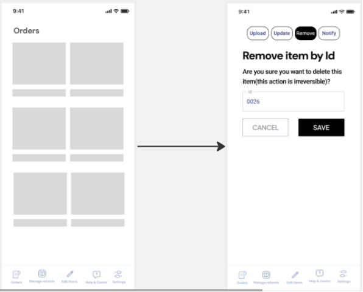

  

# Universidad Peruana de Ciencias Aplicadas

## Carrera de Ingeniería de Software

**Ciclo:** 2025 - 1  
**Curso:** Diseño de Experimentos de Ingeniería de Software - 1ASI0732  
**Sección:** 4429  
**Docente:** Ivan Robles Fernández 

**Startup:** VisionTech  
**Producto:** VehiTunning

| Código      | Nombre                           |
|-------------|----------------------------------|
| U202212112  | Luis Sebastian Chinchihualpa Saldarriaga   |
| U  | Franky Oswald Mallma Espiritu   |
| U20211G671  | Britney Delhy Qqueso Rodriguez   |

**Abril - 2025**

# **Registro de Versiones**

<table>
  <thead>
    <tr>
        <th>Versión</th>
        <th>Fecha</th>
        <th>Autor</th>
        <th>Descripción de modificación</th>
    </tr>
  </thead>
  <tbody>
  <tr>
      <td><strong>TB1</strong></td>
      <td>Abril</td>
      <td>
        <ul>
          <li>Luis Chinchihualpa</li>
          <li>Franky Mallma</li>
          <li>Britney Qqueso</li>
        </ul>
      </td>
      <td>
        Se han incluído los siguientes capítulos:
        <ul>
          <li>Capítulo I: Introducción</li>
          <li>Capítulo II: Requirements Elicitation & Analysis</li>
          <li>Capítulo III: Requirements Specification</li>
          <li>Capítulo IV: Product Design</li>
          <li>Avance del Capítulo V: Software Configuration Managemen y Product Implementation & Deployment.</li>
          <li>Avance de Conclusiones, Bibliografía y Anexos</li>
        </ul>
      </td>
  </tr>
  </tbody>
</table>

# **Student Outcomes**
<table style="border-collapse: collapse; width: 100%; border: 1px solid black;">
  <thead>
    <tr style="border-bottom: 1px solid black;">
      <th style="border-right: 1px solid black;">Criterio Específico</th>
      <th style="border-right: 1px solid black;">Acciones Realizadas</th>
      <th>Conclusiones</th>
    </tr>
  </thead>
    <tbody>
    <tr style="border-bottom: 1px solid black;">
      <td style="border-right: 1px solid black;"><strong>4.c.1 Reconoce responsabilidad ética y profesional en situaciones de ingeniería de software</strong></td>
      <td style="border-right: 1px solid black;">
<strong>TB1</strong>
</td>
      <td></td>
     </tr>
     <tr style="border-bottom: 1px solid black;">
      <td style="border-right: 1px solid black;"><strong>4.c.2 Emite juicios informados considerando el impacto de las soluciones de ingeniería de software en contextos globales, económicos, ambientales y sociales</strong></td>
      <td style="border-right: 1px solid black;">
<strong>TB1</strong>
</td>
      <td></td>
     </tr>
  </tbody>
</table>

# **Project Report Online**

URL Project Report (Github): 

# Capítulo I: Introducción

## 1.1 Startup Profile
### 1.1.1 Descripción de la Startup
VisionTech es una startup creada por estudiantes de la Facultad de Ingeniería de la Universidad Peruana de Ciencias Aplicadas (UPC), con la motivación de transformar la experiencia de personalización automotriz. Nace con el compromiso de solucionar las principales barreras que enfrentan los entusiastas de los autos al personalizar sus vehículos, como la falta de orientación profesional, la escasa variedad de servicios, precios poco accesibles y una limitada transparencia en el proceso.

A través de nuestra plataforma VehiTunning, ofrecemos un ecosistema digital completo que conecta a usuarios con proveedores certificados, facilitando decisiones informadas mediante cotizaciones automatizadas, comparativas inteligentes y asesoramiento especializado. Contamos con un equipo apasionado por la innovación tecnológica y la ingeniería de calidad, que trabaja incansablemente para garantizar una experiencia de personalización única, accesible y completamente centrada en las expectativas de cada usuario.

**Misión:**  
Facilitar la personalización automotriz a través de una plataforma digital accesible, inteligente y transparente, que brinde a los usuarios atención personalizada, precios justos y asesoramiento técnico especializado.

**Visión:**  
Convertirnos en referentes globales en innovación para la personalización automotriz, siendo reconocidos por nuestra transparencia, calidad técnica y compromiso con una experiencia de usuario extraordinaria que combine tecnología de vanguardia y atención personalizada.

### 1.1.2 Perfiles de integrantes del equipo

|  Nombres y Apellidos |    Codigo   | Descripción | Foto | 
|----------------------|-------------|-------------|------|
|   |     |     |     |    |
| Luis Sebastian Chinchihualpa Saldarriaga |  U.......  | descripcion de cada uno |      |
| Franky Oswald Mallma Espiritu |  U..... | descripcion de cada uno |     |
| Britney Delhy Qqueso Rodriguez | U20211G671 | Soy estudiante de la carrera de Ingeniería de Software en la Universidad Peruana de Ciencias Aplicadas (UPC). Me considero una persona autodidacta, dedicada, creativa y responsable. Cuento con experiencia en liderazgo y trabajo en equipo, y disfruto aprendiendo tanto de las personas como de las tecnologías con las que colaboro. Poseo conocimientos en diversos lenguajes de programación, como Python, HTML, CSS, JavaScript, entre otros. |     |

## 1.2 Solution Profile
### 1.2.1 Antecedentes y problemática
#### What
**¿Cuál es el problema?**  
En la actualidad, el sector de personalización automotriz enfrenta una falta alarmante de transparencia y un auge de prácticas poco éticas por parte de talleres y vendedores de accesorios. Esta situación genera desinformación entre los entusiastas del tuning, quienes no cuentan con el conocimiento necesario para diferenciar entre servicios auténticos y engañosos. Como resultado, muchos terminan tomando decisiones equivocadas, adquiriendo productos de baja calidad o pagando precios injustificados.

**¿Cuál es la relación con la persona en cuestión?**  
El usuario final es un entusiasta automotriz que busca personalizar su vehículo pero se enfrenta a un mercado desorganizado, con presupuestos opacos y sin asesoramiento técnico confiable. VehiTunning se posiciona como una solución que centraliza la información, asesora al usuario y garantiza precios justos y procesos transparentes.

#### When
**¿Cuándo sucede el problema?**  
El problema se presenta durante el proceso de personalización de un vehículo, al cotizar accesorios, realizar modificaciones estéticas o técnicas, o al elegir servicios especializados. La falta de referencias claras y profesionales capacitados expone a los consumidores a engaños frecuentes.

**¿Cuándo utiliza el cliente el producto?**  
El cliente accede a VehiTunning antes, durante y después de la personalización de su vehículo: para explorar opciones, comparar precios, recibir asesoría experta, seleccionar proveedores verificados y monitorear el proceso en tiempo real.

#### Where
**¿Dónde está el cliente cuando utiliza el producto?**  
Los usuarios pueden utilizar VehiTunning desde sus hogares, talleres mecánicos o concesionarios, accediendo desde computadoras, smartphones o tablets.

**¿Dónde surge el problema?**  
El problema se origina en talleres físicos, tiendas de accesorios y plataformas en línea que operan sin regulaciones claras ni controles de calidad, lo cual permite la existencia de estafas, sobreprecios y desinformación.

#### Who
**¿Quiénes están involucrados?**  
Clientes apasionados por los automóviles, técnicos mecánicos, proveedores de repuestos y servicios, talleres de modificación y plataformas digitales de venta.

**¿A quiénes les sucede el problema?**  
A los consumidores interesados en modificar o mejorar sus vehículos, que frecuentemente son víctimas de presupuestos inflados, componentes de dudosa procedencia o instalaciones deficientes.

**¿Quién lo utiliza?**  
VehiTunning está diseñado para ser utilizado por clientes finales, pero también por talleres aliados que deseen integrarse a un ecosistema más ético y transparente, promoviendo la confianza y la profesionalización del rubro.

#### Why
**¿Cuál es la causa del problema?**  
La raíz del problema radica en la falta de regulación del mercado y en la escasa disponibilidad de herramientas confiables que permitan comparar opciones, verificar reputaciones o acceder a asesoría especializada. Esto propicia un entorno propenso al abuso y la desinformación.

#### How
**¿En qué condiciones nuestros clientes usan el producto?**  
En contextos urbanos, de alto tráfico automotor, donde existe una fuerte cultura del tuning pero con acceso limitado a información confiable. Los usuarios recurren a VehiTunning cuando desean asegurar una experiencia personalizada, segura y transparente.

**¿Cómo nos conocieron nuestros compradores?**  
A través de redes sociales, foros automotrices, alianzas con talleres certificados, recomendaciones entre usuarios y eventos de cultura tuning.

**Cómo prefieren nuestros consumidores acceder a nuestro producto?**  
Mediante una app intuitiva y una plataforma web responsive que ofrezca comparadores de precios, asistencia virtual personalizada y un sistema de calificaciones comunitarias.

**¿Qué llevó a la persona a esa situación?**  
La necesidad de personalizar su vehículo sin caer en sobrecostos ni fraudes, buscando además una experiencia acompañada, confiable y eficiente.

#### How Much
Según Peru21 (2023), el auge del comercio electrónico ha incrementado notablemente las estafas digitales. Se estima que el 4% de los afectados por fraudes online en el país ha perdido más de 5,000 soles, siendo el sector automotriz uno de los más golpeados. En Lima, numerosos consumidores han sido víctimas de sitios web falsos que ofrecen productos a precios atractivos, pero no entregan lo prometido. Estas prácticas minan la confianza del público y afectan gravemente la reputación del sector.

### 1.2.2 Lean UX Process
#### 1.2.2.1 Lean UX Problem Statements
Nuestro servicio de personalización automotriz busca ofrecer una experiencia óptima tanto para los clientes interesados en modificar sus vehículos como para el personal técnico especializado que ejecuta estas modificaciones. Sin embargo, hemos identificado un desafío importante que afecta la efectividad del servicio: la falta de claridad en la comunicación y la poca transparencia en los procesos dificultan que los clientes comprendan plenamente las opciones disponibles. Esta situación impacta negativamente en su nivel de satisfacción y limita el potencial comercial del servicio.

La experiencia actual revela que los usuarios enfrentan dificultades para explorar y entender las posibilidades de personalización, lo que los lleva a tomar decisiones poco informadas. A su vez, el personal técnico experimenta complicaciones para transmitir adecuadamente las alternativas, lo cual impide gestionar de forma eficiente las expectativas del cliente. Esta desconexión entre lo que los usuarios esperan y lo que el servicio puede ofrecer representa una brecha crítica que debemos cerrar.

¿Cómo podemos rediseñar nuestra experiencia de personalización automotriz para mejorar la satisfacción del cliente y maximizar las oportunidades de negocio, mediante una comunicación más clara, procesos más accesibles y una experiencia de usuario más fluida?

**Aspectos:**

* **Domain:** Personalización automotriz.

* **Customer Segments:** Clientes que buscan personalizar sus vehículos y personal técnico especializado en modificaciones automotrices.

* **Pain Points:** Los clientes tienen dificultades para comprender y elegir entre las opciones de personalización, lo que genera decisiones poco acertadas y menor satisfacción. El personal técnico no cuenta con herramientas adecuadas para comunicar eficazmente las posibilidades, lo que afecta la experiencia del cliente y reduce las oportunidades de negocio.

* **Gap:** Existe una desconexión entre las expectativas de los clientes y la capacidad del equipo técnico para ofrecer una experiencia alineada a estas.

* **Visión/Strategy:** Desarrollar una plataforma intuitiva y accesible que acompañe al cliente en el proceso de personalización, facilitando la toma de decisiones informadas y fomentando una comunicación transparente entre cliente y técnico.

#### 1.2.2.2 Lean UX Assumptions
**Assumptions**  
Los supuestos (assumptions) son fundamentales para identificar riesgos del proyecto y fomentar la participación activa del equipo mediante la expresión de ideas y perspectivas diversas.

**User Assumptions**   

**¿Quién es el usuario?**
Personas propietarias de vehículos interesadas en personalizar sus autos de forma segura, confiable y práctica.

**¿Dónde encaja nuestro producto en su vida?**
Nuestro producto se integra en su día a día, ofreciendo una solución accesible para personalizar vehículos sin riesgos de estafas, cumpliendo con sus expectativas y necesidades personales.

**¿Qué problemas resuelve?**
Elimina la falta de transparencia, reduce el riesgo de fraudes y simplifica el acceso a opciones de personalización confiables.

**¿Cuándo y cómo lo usan?**
Se utiliza cuando el usuario decide personalizar su auto, brindando una plataforma disponible en cualquier momento que facilite este proceso de manera segura y eficiente.

**¿Cómo debe lucir y funcionar?**
Debe contar con un diseño intuitivo y atractivo, con una navegación sencilla que guíe al usuario paso a paso. Además, debe ofrecer seguridad, confiabilidad y resultados satisfactorios.

**Business Assumptions**  

* Los usuarios necesitan una solución digital confiable y accesible que los proteja de estafas durante el proceso de personalización.
* Una app móvil intuitiva, segura y con procesos claros puede satisfacer esta necesidad.
* Nuestros clientes iniciales serán propietarios de vehículos que buscan un servicio seguro y sin complicaciones.
* El principal valor para los clientes es la seguridad y confianza al personalizar sus vehículos.
* Beneficios adicionales: variedad de opciones, asesoramiento profesional, precios transparentes y experiencia fluida.
* La adquisición de usuarios se realizará a través de marketing digital dirigido y alianzas con concesionarios y talleres especializados.
* El modelo de ingresos incluirá suscripciones, publicidad integrada y servicios premium. También se generarán ingresos mediante alianzas estratégicas con técnicos especializados.
* La competencia incluye apps similares, talleres físicos y tiendas especializadas.
* Nos destacaremos por nuestra atención a la seguridad, la transparencia, la diversidad de opciones y una experiencia de usuario superior.
* El principal riesgo es la desconfianza en la plataforma.
* Lo mitigamos mediante validaciones rigurosas de los técnicos, medidas de seguridad sólidas y una comunicación clara con los usuarios.

**Business Outcomes**    

* **Mayor retención de clientes:** Una experiencia segura y eficiente impulsará la lealtad del usuario y la recurrencia.
* **Reputación fortalecida:** Al cumplir las expectativas, mejoramos la imagen de marca y generamos mayor confianza en el mercado.
* **Incremento en ingresos:** Más usuarios satisfechos conducen a un mayor volumen de transacciones.
* **Mayor visibilidad:** Al ofrecer una solución efectiva y diferenciada, ganamos reconocimiento y captamos nuevos clientes.

**User Outcomes**  

* **Eficiencia mejorada:** Los usuarios personalizan sus vehículos más rápidamente, ahorrando tiempo y esfuerzo.
* **Decisiones informadas:** Acceso claro a opciones y detalles técnicos permite elegir con mayor seguridad.
* **Menor estrés:** La facilidad de uso reduce la frustración común en estos procesos.
* **Satisfacción elevada:** Al obtener el resultado esperado, se eleva la satisfacción tanto personal como con el servicio.

**Features**  

* **Gestión centralizada de información:** Plataforma unificada para acceder a datos clave de personalización, mantenimiento y desempeño de partes.
* **Paneles de control personalizables:** Visualización flexible de información adaptada a las preferencias del usuario.
* **Opciones de personalización del sistema:** Ajustes según tipo de vehículo y preferencias personales.
* **Herramientas de seguimiento:** Registro de modificaciones, progreso y análisis de tendencias para futuras decisiones de personalización.

#### 1.2.2.3 Lean UX Hypothesis Statements
**Creemos que** al ofrecer una plataforma centralizada e intuitiva para la gestión de la personalización vehicular, los usuarios podrán completar sus proyectos de forma más rápida y eficiente.  
**Sabremos que lo logramos cuando** los usuarios compartan comentarios positivos, el tiempo promedio para completar tareas de personalización se reduzca en un 30%, y la tasa de abandono de proyectos disminuya en un 40%.  

**Creemos que** al proporcionar información clara y detallada sobre las opciones disponibles, los usuarios podrán tomar decisiones mejor fundamentadas, alineadas con sus gustos y necesidades.  
**Sabremos que lo logramos por** medio de testimonios que indiquen que la plataforma facilitó sus decisiones, un incremento del 35% en la satisfacción con las personalizaciones elegidas, y un aumento del 40% en la conversión de exploración a compra.  

**Creemos que** al ofrecer una experiencia positiva y resolver eficazmente las necesidades del usuario, la plataforma ganará una mejor reputación y mayor credibilidad en el mercado.  
**Sabremos que lo logramos mediante** comentarios de clientes potenciales que reflejen confianza en la plataforma, un aumento del 40% en la tasa de conversión de leads, y una mejora del 25% en la satisfacción general del cliente.  

#### 1.2.2.4 Lean UX Canvas

## 1.3 Segmentos objetivo
**Segmento #1: Clientes que desean personalizar sus vehículos**  
Este segmento está compuesto por personas interesadas en mejorar y personalizar sus autos como una forma de expresión personal, estilo de vida y diferenciación. Buscan opciones innovadoras, asesoramiento especializado y experiencias que les permitan destacar con originalidad.

**Aspectos demográficos:**  
  * **Sexo:** Masculino y femenino
  * **Edades:** Entre 18 y 50 años
  * **Nivel socioeconómico:**
    *Profesionales con altos ingresos y empresarios
    *Ejecutivos, gerentes y profesionales con ingresos medio-altos
    *Jóvenes profesionales, emprendedores y trabajadores con ingresos medios

**Aspectos geográficos:**  
  * **Nacionalidad:** Peruana
  * **Ubicación:** Principalmente en zonas urbanas y suburbanas de Perú, como Lima Metropolitana, Arequipa, Trujillo, entre otras

**Aspectos psicográficos:**
  * **Motivaciones:** Expresar su personalidad a través del diseño del vehículo, destacar en su entorno social, disfrutar del proceso creativo y del asesoramiento experto
  * **Intereses:** Tecnología automotriz, diseño, estética, tendencias de customización, experiencias diferenciadas
  * **Comportamiento:** Buscan plataformas que simplifiquen el proceso de personalización, comparan alternativas, valoran la calidad, la innovación y la atención personalizada

**Segmento #2: Personal técnico y staff mecánico**  
Este segmento está conformado por técnicos automotrices, mecánicos e ingenieros que forman parte del ecosistema de personalización. Su rol es clave en la implementación de mejoras en los vehículos y están en constante búsqueda de herramientas, técnicas y conocimientos para optimizar su trabajo.

**Aspectos demográficos:**
  * **Sexo:** Mayoritariamente masculino, con creciente participación femenina
  * **Edades:** Entre 20 y 60 años
  * **Nivel socioeconómico:**
    *Ingenieros automotrices, técnicos especializados
    *Mecánicos con trayectoria y formación técnica sólida
    *Ayudantes de taller, aprendices

**Aspectos geográficos:**
  * **Nacionalidad:** Peruana
  * **Ubicación:** Zonas urbanas y suburbanas con alta densidad de talleres, como Lima, Callao, Arequipa, etc.

**Aspectos psicográficos:**
  * **Motivaciones:** Mejorar sus habilidades, brindar un mejor servicio, adaptarse a nuevas tecnologías, ser reconocidos por su experiencia
  * **Intereses:** Mecánica automotriz, herramientas digitales, actualización constante, aprendizaje técnico
  * **Comportamiento:** Participan en capacitaciones, valoran plataformas que faciliten su trabajo, buscan soluciones eficientes y colaborativas

# Capítulo II: Requirements Elicitation & Analysis

## 2.1 Competidores
### 2.1.1 Análisis competitivo

### 2.1.2 Estrategias y tácticas frente a competidores

Revisando nuestra propuesta inicial de estrategias llegamos en grupo a las siguientes tácticas que pondremos en marcha frente a nuestros competidores:
-	Optimización en el tiempo de carga de las imágenes dentro la plataforma a través del uso de imágenes en formato .webp con el fin de mejorar la experiencia de usuario.

-	Implementación de componentes skeleton dentro de todas las pages de la aplicación con el fin de no sobrecargar el DOM con procesos de renderización innecesarios.
-	Trabajar en el SEO de la plataforma para así lograr posicionarla entre los principales resultados de búsqueda de forma orgánica.

-	Implementación de Lazy Loading para cargar contenido a medida que el usuario lo necesite, lo que puede mejorar significativamente los tiempos de carga de la página inicial y reducir la carga inicial de recursos.

-	Auditorías de rendimiento regulares para monitorear el rendimiento de la plataforma y así lograr identificar posibles cuellos de botella y áreas de mejora continua con herramientas como Lighthouse.

-	Optimización de archivos CSS y JavaScript, con el fin de reducir el tamaño de los mismo para mejorar los tiempos de carga de la página y la velocidad general del sitio. Por lo que sería necesario verificar clases tanto en CSS y en Javascript que no se estén utilizando.

-	Integración de ARIA para mejorar la accesibilidad en los elementos HTML de la plataforma para usuarios con discapacidades. 

-	Ofrecer asistencia 24/7 al cliente a través de canales como chatbots programados con las preguntas más frecuentes y sus respectivas respuestas.

## 2.2 Entrevistas
### 2.2.1 Diseño de entrevistas

Para realizar los componentes elaboramos las preguntas para obtener información de nuestros segmentos objetivos mediante las entrevistas.
1.	Preguntas principales:
1.1.	¿Cómo te llamas?
1.2.	¿Qué edad tienes?
1.3.	¿Dónde vives?
1.4.	¿Cuál es tu profesión?
1.5.	¿Cuál es tu estado civil?

2.	Preguntas específicas y complementarias:

Segmento objetivo: Personas que buscan customizar sus autos

2.1.	¿Has tenido la oportunidad de personalizar tu carro anteriormente? Coméntanos sobre tu experiencia

2.2.	¿Qué te motiva a personalizar tu auto?

2.3.	¿Qué dispositivos prefieres utilizar para buscar información sobre la personalización de automóviles?

2.4.	¿Qué canales digitales usualmente utilizas para obtener ideas para mejorar tu carro?

2.5.	¿Has presentado alguna mala experiencia al personalizar tu auto en el pasado?

2.6.	¿Qué es lo que te gustaría que una plataforma de personalización de automóviles solucionara?

2.7.	¿Qué marcas de vehículos son de tu preferencia?

Segmento objetivo: Staff mecánico

2.8.	¿Qué productos brindas para la personalización de autos?

2.9.	¿Cuál ha sido tu experiencia trabajando con clientes que buscan personalizar sus autos?

2.10.	¿Qué canales utilizas para promocionar tus productos?

2.11.	¿Cómo prefieres interactuar con los clientes interesados en los productos?

2.12.	¿Has trabajado anteriormente con plataformas de personalización de automóviles?

2.13.	¿Qué buscas en una aplicación de personalización de carros?

2.14.	¿Cuáles son las marcas de automóviles con las que tienes mayor experiencia?

### 2.2.2 Registro de entrevistas

Segmento objetivo: Clientes que buscan customizar sus autos
Entrevista 1:
Entrevistador: Abraham Israel Ayquipa
Datos del entrevistado:
- Nombre: Luis Jean  
- Apellidos: Piere Espejo  
- Edad: 19 años  
- Distrito: Surco  
- Educación: Estudiante de derecho en la universidad UPC  
 
Duración de la entrevista: 3 minutos
Inicio de de la entrevista: 00:00
Link: https://upcedupe-my.sharepoint.com/:v:/g/personal/u20201c607_upc_edu_pe/ETkXbFSbZatDpAEvHzTPTJMB-mXrG_XL1xe922soG6czhQ?nav=eyJyZWZlcnJhbEluZm8iOnsicmVmZXJyYWxBcHAiOiJTdHJlYW1XZWJBcHAiLCJyZWZlcnJhbFZpZXciOiJTaGFyZURpYWxvZy1MaW5rIiwicmVmZXJyYWxBcHBQbGF0Zm9ybSI6IldlYiIsInJlZmVycmFsTW9kZSI6InZpZXcifX0%3D&e=fIFERB
Resumen de la entrevista: Luis ha personalizado su vehículo anteriormente, haciendo cambios específicos como la suspensión, el color y los rines. Su motivación para personalizar su vehículo parece centrarse en el uso personal y la comodidad, además de reflejar sus gustos y preferencias actuales. Luis utiliza principalmente su smartphone y computadora para buscar información sobre personalización de vehículos. Usa internet y menciona específicamente a Facebook Marketplace como medios para obtener ideas y realizar modificaciones en su vehículo. Luis ha enfrentado problemas con la calidad de los materiales y servicios recibidos, mencionando una experiencia negativa con la suspensión, el color y los rines que no cumplían sus expectativas.
Además, señala problemas con una aplicación de personalización de vehículos que se trabaja frecuentemente y no le brinda la confianza deseada. Luis espera que las plataformas de personalización de vehículos sean más fluidas, sin trabas, y que ofrezcan una variedad de accesorios claramente categorizados. Luis es un joven estudiante interesado en la personalización de vehículos como una forma de expresión personal y mejora de la comodidad. Sus experiencias anteriores le han enseñado la importancia de la calidad y la confiabilidad, tanto en los productos como en las plataformas utilizadas para la personalización. Él resalta la necesidad de plataformas intuitivas y eficientes que puedan manejar información y transacciones sin errores.
Entrevista 2:
Entrevistador: Mariana Alexandra Chambi Mendoza
Entrevistado:
Datos del entrevistado:
- Nombre: Sebastian  
- Apellidos: Escobar  
- Edad: 19 años  
- Distrito: Surco  
- Educación: Estudiante de ingeniería de software  
 
Duración de la entrevista: 4 minutos con 18 segundos
Inicio de de la entrevista: 0:30
Link: https://upcedupe-my.sharepoint.com/:v:/g/personal/u20201c607_upc_edu_pe/ETkXbFSbZatDpAEvHzTPTJMB-mXrG_XL1xe922soG6czhQ?nav=eyJyZWZlcnJhbEluZm8iOnsicmVmZXJyYWxBcHAiOiJTdHJlYW1XZWJBcHAiLCJyZWZlcnJhbFZpZXciOiJTaGFyZURpYWxvZy1MaW5rIiwicmVmZXJyYWxBcHBQbGF0Zm9ybSI6IldlYiIsInJlZmVycmFsTW9kZSI6InZpZXcifX0%3D&e=fIFERB
Resumen de la entrevista: Sebastián describe su experiencia de personalización de automóviles como emocionante y divertida, destacando que realizó modificaciones estéticas y añadió accesorios que mejoran tanto la apariencia como el rendimiento de su vehículo. La motivación principal de Sebastián para personalizar su auto es hacerlo único y reflejar su personalidad. Además, busca mejorar el rendimiento y la funcionalidad del vehículo para adaptarlo a sus gustos personales. Sebastián utiliza principalmente su ordenador y, en ocasiones, su teléfono móvil. Consulta revistas, periódicos y participa en foros en línea con especialistas y la comunidad que comparten ideas sobre personalización. También utiliza YouTube para encontrar tutoriales detallados y videos sobre personalización de automóviles, y sigue cuentas en redes sociales como Instagram para inspiración y nuevas ideas. Aunque Sebastián no ha tenido experiencias negativas personales significativas en la personalización de su auto, es consciente de los problemas que otros han enfrentado, como piezas de baja calidad o instalaciones deficientes. Esto lo motiva a investigar y seleccionar cuidadosamente los productos y servicios. Sebastián desea que una plataforma de personalización de automóviles ofrezca una amplia gama de productos de calidad y servicios confiables. Valora la idea de una comunidad activa donde los usuarios puedan compartir experiencias y consejos, así como herramientas interactivas para visualizar posibles modificaciones en el vehículo antes de realizarlas. Prefiere marcas como Toyota, destacando la calidad de rendimiento y las opciones de prevención que ofrecen. La entrevista revela que Sebastián es un joven apasionado por la personalización de automóviles, enfocado en la calidad y la individualización. Sus comentarios proporcionan insights valiosos para el proyecto, subrayando la importancia de la calidad, la personalización y el soporte.
 
Entrevista 3:
Entrevistador: Alexandra Alexandra Ramos Argüelles
Entrevistado:
Datos del entrevistado:
- Nombres: Melany  
- Apellidos: Ramos Argüelles  
- Edad: 27 años  
- Distrito: Villa María del Triunfo  
- Profesión: Ingeniera de software  
 
Duración de la entrevista: 4 minutos con 37 segundos
Inicio de la entrevista: 01:19
Link: https://upcedupe-my.sharepoint.com/:v:/g/personal/u20201c607_upc_edu_pe/ETkXbFSbZatDpAEvHzTPTJMB-mXrG_XL1xe922soG6czhQ?nav=eyJyZWZlcnJhbEluZm8iOnsicmVmZXJyYWxBcHAiOiJTdHJlYW1XZWJBcHAiLCJyZWZlcnJhbFZpZXciOiJTaGFyZURpYWxvZy1MaW5rIiwicmVmZXJyYWxBcHBQbGF0Zm9ybSI6IldlYiIsInJlZmVycmFsTW9kZSI6InZpZXcifX0%3D&e=fIFERB
Resumen de la entrevista: Aunque Melany aún no ha personalizado su automóvil, muestra un fuerte interés en hacer modificaciones visuales, como cambiar el color y agregar imágenes, así como mejoras internas. Su motivación para personalizar el auto proviene de un deseo de que el vehículo refleje su personalidad y gustos personales. Melany utiliza principalmente su celular, computadora y, raramente, su iPad para buscar información sobre personalización. Usa Google y TikTok para obtener ideas y también consulta con su mecánico para obtener asesoramiento técnico. Melany menciona no haber personalizado su auto todavía, pero ha tenido problemas con la reparación del vehículo debido a la falta de un mecánico de confianza en el pasado. Esto subraya la importancia de la fiabilidad y la confianza en los servicios relacionados con su vehículo. Espera que una plataforma de personalización de automóviles le ofrezca sugerencias personalizadas, como mostrar una variedad de colores y cómo estos podrían lucir en su vehículo. También le gustaría ver comparativas sobre mejoras internas y sugerencias sobre qué podría añadir o mejorar en su auto. Posee un Suzuki y expresa preferencia por marcas como Toyota y Hyundai, valorando la disponibilidad y facilidad de encontrar repuestos. También menciona a Nissan como una marca de interés. Melany busca una experiencia de personalización que combine la estética con mejoras funcionales, reflejando su enfoque práctico como ingeniera de software. Su enfoque en la fiabilidad y el soporte técnico destaca la necesidad de una plataforma que ofrezca no solo opciones de personalización, sino también información confiable y accesible sobre el mantenimiento y la mejora de vehículos.

Segmento objetivo: Staff mecánico
 
Entrevista 1:
Entrevistador: Franky Mallma Espiritu
Datos del entrevistado:
- Nombres: Alex  
- Apellidos: Martinez Guzman  
- Edad: 20 años  
- Distrito: Santa Anita  
- Profesión: Técnico especialista en Automotriz 
 
Duración: 3 minutos con 8 segundos
Inicio de la entrevista: 0:30
Link: https://upcedupe-my.sharepoint.com/:v:/g/personal/u20201c607_upc_edu_pe/ETkXbFSbZatDpAEvHzTPTJMB-mXrG_XL1xe922soG6czhQ?nav=eyJyZWZlcnJhbEluZm8iOnsicmVmZXJyYWxBcHAiOiJTdHJlYW1XZWJBcHAiLCJyZWZlcnJhbFZpZXciOiJTaGFyZURpYWxvZy1MaW5rIiwicmVmZXJyYWxBcHBQbGF0Zm9ybSI6IldlYiIsInJlZmVycmFsTW9kZSI6InZpZXcifX0%3D&e=fIFERB
Resumen de la entrevista: El técnico ofrece personalización de autos, incluyendo kits de carrocería, sistemas de escape de alto rendimiento, y alerones. Se enfoca en mejorar tanto la estética como el rendimiento del motor de los vehículos. La experiencia del técnico con los clientes ha sido positiva, trabajando en proyectos que varían desde modificaciones menores hasta transformaciones completas de vehículos. Esto implica cambios significativos en la apariencia y el rendimiento del automóvil. Utiliza principalmente redes sociales como Facebook y WhatsApp para promocionar sus productos y servicios. Prefiere interactuar directamente con los clientes, ya sea en persona, por teléfono o mediante mensajes directos a través de las redes sociales. A pesar de su experiencia en personalización, no ha utilizado plataformas de personalización de autos en línea; siempre ha trabajado en locales y talleres físicos. El técnico estaría interesado en una aplicación que permita a los usuarios explorar diferentes modificaciones y acceder a una comunidad de profesionales y entusiastas del automovilismo para intercambiar ideas y conocimientos. Ha trabajado principalmente con marcas como Nissan, Toyota y Kia, personalizando modelos como Sedanes y Corolas. Este técnico especialista representa una perspectiva práctica y directa en el campo de la personalización de automóviles. Su enfoque en la interacción personal y el uso limitado de plataformas digitales sugiere una preferencia por métodos tradicionales de trabajo, aunque muestra interés en las posibilidades que una plataforma digital podría ofrecer para la colaboración y el intercambio de ideas. Esto indica una posible área de oportunidad para desarrollar herramientas que faciliten la conexión entre profesionales del sector automotriz y entusiastas de la personalización de vehículos.
 
 
Entrevista 2:
Entrevistador: Natanael David Soto Salis
Datos del entrevistado:
- Nombres: Eduardo  
- Apellidos: Guimaraes  
- Edad: 23 años  
- Distrito: Surco  
- Profesión: Mecánico automotriz  
 
Duración: 5 minutos con 28 segundos
Inicio de de la entrevista: 01:00
Link: https://upcedupe-my.sharepoint.com/:v:/g/personal/u20201c607_upc_edu_pe/ETkXbFSbZatDpAEvHzTPTJMB-mXrG_XL1xe922soG6czhQ?nav=eyJyZWZlcnJhbEluZm8iOnsicmVmZXJyYWxBcHAiOiJTdHJlYW1XZWJBcHAiLCJyZWZlcnJhbFZpZXciOiJTaGFyZURpYWxvZy1MaW5rIiwicmVmZXJyYWxBcHBQbGF0Zm9ybSI6IldlYiIsInJlZmVycmFsTW9kZSI6InZpZXcifX0%3D&e=fIFERB
Resumen de la entrevista: Eduardo menciona que la personalización más popular entre sus clientes es la variedad de colores para los autos, que es el producto más vendido. Además, ofrece servicios para cambiar repuestos según las necesidades específicas de cada vehículo. Utiliza principalmente su teléfono Android para comunicarse con sus clientes. Prefiere usar Google Chrome por su confiabilidad y popularidad. Utiliza WhatsApp y redes sociales, destacando que maneja un catálogo en WhatsApp y promociona sus servicios en Facebook. Eduardo describe que ha tenido experiencias variadas con los clientes, con algunos que aprecian su trabajo y otros que no quedan completamente satisfechos. Sin embargo, indica que generalmente logra que los clientes estén contentos con el resultado final. Promueve sus productos y servicios a través de WhatsApp y Facebook, y está abierto a explorar otras soluciones tecnológicas que puedan mejorar la interacción con los clientes y acortar los tiempos de respuesta. Hasta ahora, Eduardo no ha utilizado plataformas específicas de personalización de automóviles más allá de WhatsApp para la comunicación. Muestra interés en una aplicación que permita a los clientes seguir el estado de la personalización de sus vehículos, lo que podría aumentar la satisfacción del cliente al reducir la incertidumbre y mejorar la experiencia general. Eduardo busca una aplicación que ofrezca seguimiento en tiempo real del estado de la personalización, lo que sugiere que valora la transparencia y la eficiencia en el servicio al cliente. Esto indica una oportunidad para el desarrollo de herramientas digitales que mejoren la gestión y el seguimiento de los proyectos de personalización. En resumen, Eduardo es un mecánico que combina técnicas tradicionales con el uso de herramientas digitales modernas para comunicarse y gestionar sus servicios de personalización de automóviles. Está interesado en adoptar nuevas tecnologías que mejoren la interacción con los clientes y la gestión de sus proyectos.
 
Entrevista 3:
Entrevistador: Natanael David Soto Salis
Datos del entrevistado:
- Nombres: Diego Rafael  
- Apellidos: Cisneros  
- Edad: 25 años  
- Distrito: Chorrillos  
- Profesión: Mecánica automotriz  
Duración: 3 minutos con 41 segundos
Inicio de de la entrevista: 17:26
Link: https://upcedupe-my.sharepoint.com/:v:/g/personal/u20201c607_upc_edu_pe/ETkXbFSbZatDpAEvHzTPTJMB-mXrG_XL1xe922soG6czhQ?nav=eyJyZWZlcnJhbEluZm8iOnsicmVmZXJyYWxBcHAiOiJTdHJlYW1XZWJBcHAiLCJyZWZlcnJhbFZpZXciOiJTaGFyZURpYWxvZy1MaW5rIiwicmVmZXJyYWxBcHBQbGF0Zm9ybSI6IldlYiIsInJlZmVycmFsTW9kZSI6InZpZXcifX0%3D&e=fIFERB
Resumen de la entrevista: Diego utiliza un dispositivo especializado para diagnosticar el estado de los automóviles, lo cual le permite detectar problemas mecánicos de forma precisa. También usa su celular para la gestión de clientes y comunicación. Prefiere utilizar Microsoft Edge para sus necesidades de navegación en internet. Ofrece una variedad de productos para personalizar autos, incluyendo partes de carrocería y neumáticos. También trabaja con motores, aunque indica que estos son pedidos más complejos. La mayoría de sus experiencias con clientes han sido positivas, especialmente porque estos clientes suelen estar entusiasmados con la personalización de sus autos y tienen ideas claras de lo que quieren. Diego promociona sus productos y servicios principalmente a través de anuncios en Facebook e Instagram, y ocasionalmente usa WhatsApp para contactar clientes activos. Prefiere interactuar con los clientes a través de llamadas de voz o mensajes de WhatsApp, destacando la rapidez y eficiencia de este último. Hasta ahora, Diego no ha trabajado con plataformas digitales específicas de personalización de automóviles. Está interesado en una aplicación que ofrezca una amplia selección de partes que puedan ser filtradas por tipo de auto, modelo y tipo de partes, facilitando así la personalización según las especificaciones del cliente. Ha trabajado con muchas marcas, pero menciona específicamente que algunas, como Subaru y Honda , son más fáciles de manipular. Diego Rafael es un profesional apasionado por la mecánica y personalización de automóviles, que utiliza tanto herramientas modernas de diagnóstico como métodos de comunicación avanzados para mejorar la interacción con sus clientes y eficientizar su trabajo. La entrevista destaca su adaptabilidad y su enfoque en proporcionar servicios personalizados que cumplan con las expectativas claras y entusiastas de sus clientes.
 
Clientes:
1.- https://upcedupe-my.sharepoint.com/:v:/g/personal/u202218475_upc_edu_pe/EZp1DzZM6DZOr8j0VWxJ1cgB8xB14s-o7sRNNm-0kVtLmQ?e=JERfdg&nav=eyJyZWZlcnJhbEluZm8iOnsicmVmZXJyYWxBcHAiOiJTdHJlYW1XZWJBcHAiLCJyZWZlcnJhbFZpZXciOiJTaGFyZURpYWxvZy1MaW5rIiwicmVmZXJyYWxBcHBQbGF0Zm9ybSI6IldlYiIsInJlZmVycmFsTW9kZSI6InZpZXcifX0%3D
2.- https://upcedupe-my.sharepoint.com/:v:/g/personal/u202217389_upc_edu_pe/ESfS-tEn1itPtPKBoOREscYBFqkD7V0P7QnoYYEYew7_cA?nav=eyJyZWZlcnJhbEluZm8iOnsicmVmZXJyYWxBcHAiOiJTdHJlYW1XZWJBcHAiLCJyZWZlcnJhbFZpZXciOiJTaGFyZURpYWxvZy1MaW5rIiwicmVmZXJyYWxBcHBQbGF0Zm9ybSI6IldlYiIsInJlZmVycmFsTW9kZSI6InZpZXcifX0%3D&e=Sz2OjQ
3.-  https://youtu.be/LxC_n2O_fNA 
 
Staff:
1.- https://youtu.be/BGKFJ98RtPE 
2.- https://upcedupe-my.sharepoint.com/:v:/g/personal/u20201c607_upc_edu_pe/ETUukYhBm0RFggzWS9SpNroBNNuvJ4E0MvytyLczJxHYzA?e=XAaWrh&nav=eyJyZWZlcnJhbEluZm8iOnsicmVmZXJyYWxBcHAiOiJTdHJlYW1XZWJBcHAiLCJyZWZlcnJhbFZpZXciOiJTaGFyZURpYWxvZy1MaW5rIiwicmVmZXJyYWxBcHBQbGF0Zm9ybSI6IldlYiIsInJlZmVycmFsTW9kZSI6InZpZXcifX0%3D
3.- https://upcedupe-my.sharepoint.com/:v:/g/personal/u20201c607_upc_edu_pe/Ee922foWWb5HrnfCZN7R6o8BGmKg_zMlYrQyYo1OUST4Gg?e=rwZKCo

### 2.2.3 Análisis de entrevistas

### Segmento objetivo: Clientes que buscan customizar sus autos

#### Características Objetivas:
- Uso de Tecnología:
  - Todos los entrevistados utilizan principalmente dispositivos tecnológicos para buscar información sobre personalización de vehículos, con una preferencia por smartphones y computadoras.
  - Luis utiliza principalmente su smartphone y computadora.
  - Sebastián utiliza principalmente su ordenador y ocasionalmente su teléfono móvil.
  - Melany utiliza su celular, computadora y, ocasionalmente, su iPad.
- Canales de Interacción:
  - Luis menciona específicamente Facebook Marketplace como un medio para obtener ideas y realizar modificaciones en su vehículo.
  - Sebastián consulta revistas, periódicos, foros en línea, YouTube y redes sociales como Instagram para obtener inspiración y nuevas ideas.
  - Melany utiliza Google y TikTok para obtener ideas y también consulta con su mecánico para obtener asesoramiento técnico.
- Marcas de Interés:
  - Luis no menciona preferencias específicas de marca.
  - Sebastián prefiere marcas como Toyota.
  - Melany posee un Suzuki y expresa preferencia por marcas como Toyota, Hyundai y Nissan.

#### Características Subjetivas:
- Motivaciones para Personalizar:
  - Luis está motivado por el uso personal y la comodidad, así como por reflejar sus gustos y preferencias.
  - Sebastián busca hacer su vehículo único y reflejar su personalidad, además de mejorar su rendimiento y funcionalidad.
  - Melany desea que su vehículo refleje su personalidad y gustos personales.
- Experiencias Pasadas:
  - Luis ha enfrentado problemas con la calidad de los materiales y servicios recibidos en el pasado.
  - Sebastián no ha tenido experiencias negativas significativas, pero es consciente de los problemas que otros han enfrentado.
  - Melany ha tenido problemas con la reparación del vehículo debido a la falta de un mecánico de confianza en el pasado.
- Intereses y Preferencias:
  - Luis es un joven estudiante interesado en la personalización de vehículos como una forma de expresión personal y mejora de la comodidad.
  - Sebastián es un joven apasionado por la personalización de automóviles, enfocado en la calidad y la individualización.
  - Melany tiene un enfoque práctico como ingeniera de software y busca una experiencia de personalización que combine la estética con mejoras funcionales.

Dispositivos:
Se observa una preferencia generalizada por el uso de smartphones y computadoras para la búsqueda de información sobre personalización de vehículos.
Browser:
Se observa que se usa Google Chrome como navegador favorito.

### Segmento objetivo: Staff mecánico
- Los técnicos ofrecen una variedad de servicios de personalización, con un enfoque en la modificación estética y de rendimiento de los autos.
- La experiencia con los clientes es mayormente positiva, con un enfoque en satisfacer las expectativas y deseos claros de personalización.
- WhatsApp y redes sociales son los principales canales utilizados para promocionar productos y servicios.
- La interacción preferida con los clientes es directa, ya sea en persona o a través de medios de comunicación digital.
- Ningún técnico ha trabajado con plataformas de personalización en línea hasta el momento.
- Buscan una aplicación que ofrezca seguimiento en tiempo real del estado de la personalización y una amplia selección de partes filtradas.
- Tienen experiencia con una variedad de marcas de automóviles, destacando Nissan, Toyota, Kia, Subaru y Honda.

## 2.3 Needfinding

Con el propósito de desarrollar una app que satisfaga las necesidades particulares de los usuarios, CarTunn llevará a cabo la identificación del User persona, User Task Matrix, User Journey Maps y Empathy Mapping.

### 2.3.1 User Personas

Para esta sección se presentan personajes ficticios, uno de acuerdo a cada segmento objetivo. La información que se ha utilizado para elaborar los User personas se obtuvo de las entrevistas realizadas previamente a cada segmento objetivo. La intención de las entrevistas era conocer un poco más a las personas a las que la aplicación está dirigida. Entre la información de las entrevistas que fue utilizada tenemos demografía, metas, motivaciones, frustraciones, marcas relacionadas con el tema que envuelve a la aplicación, canales digitales que más utiliza, etc. Para la creación de esta sección se utilizó la plataforma UXPressia.

Segmento objetivo: Clientes que buscan customizar sus autos  
https://uxpressia.com/w/DeRZM/p/7vFyy  

 
Segmento objetivo: Staff mecánico  
https://uxpressia.com/w/DeRZM/p/h3zhF  

### 2.3.2 User Task Matrix

"En esta sección se presenta el user task matrix, herramienta centrada en los segmentos objetivos (cliente y staff mecánico), que nos permitirá identificar las tareas y objetivos claves de los usuarios. Además, nos permitirá priorizar características y funcionalidades al momento de realizar el product backlog. Para la frecuencia se han considerado cinco opciones:nunca ,casi nunca, a veces, a menudo ,siempre; y para la importancia tres opciones: bajo, medio, alto"

Juan Velásquez (Cliente)
Tareas críticas: Comprar piezas de personalización y realizar una orden, ambas con alta frecuencia e importancia. Esto implica que la interfaz de usuario para estas acciones debe ser prioritaria, eficiente y fácil de usar.
Tarea habitual pero menos crítica: Buscar un sitio web de taller de personalización, indicando la importancia de un buen posicionamiento en buscadores y accesibilidad.

Esteban Domínguez (Staff Mecánico)
Tareas críticas: Dar la fecha de entrega de trabajo y comunicar el trabajo terminado, ambas con alta frecuencia e importancia. Esto sugiere la necesidad de una funcionalidad robusta para la gestión de tareas y notificaciones dentro del sistema.
Tarea regular: Hacer una observación sobre el trabajo, que requiere un sistema de comentarios o notas dentro de las órdenes de trabajo.

General
Las tareas del cliente están enfocadas en la interacción inicial y compra, mientras que las del staff se centran en la gestión y comunicación de los procesos de trabajo.
Este análisis subraya la necesidad de un sistema que facilite tanto la compra eficiente para el cliente como la comunicación y gestión eficaz de órdenes y personalizaciones para el staff.

### 2.3.3 User Journey Mapping

En esta sección se presentarán los user journey mapping para cada user persona.
User Journey Mapping: Cliente 
link uxpressia : https://uxpressia.com/w/DeRZM/m/NSHLe 
 
User Journey Mapping: Staff: 
link uxpressia: https://uxpressia.com/w/DeRZM/m/vPaXH 

### 2.3.4 Empathy Mapping

En esta sección se presentarán los empathy mapping de acuerdo a los user persona que se realizaron, teniendo en cuenta los dos segmentos objetivos. El empathy mapping será de utilidad debido a que podemos conocer a mayor detalle a nuestros clientes, lo que nos permite mejorar algunos aspectos de la aplicación.
Segmento objetivo: Clientes que buscan customizar sus autos
https://uxpressia.com/w/DeRZM/p/6tcWn 
 

Segmento objetivo: Staff mecánico
https://uxpressia.com/w/DeRZM/p/G0tpM 
 

### 2.3.5 As-is Scenario Mapping

En esta sección se presenta el As-Is Scenario Mapping para el segmento objetivo donde se identifican y comprenden los puntos de contacto del usuario. Para la elaboración se usó Miro.

As-is scenario Mapping : Cliente
https://miro.com/welcomeonboard/NDFUcUtZQU9SWkZ4SDhKUnNoR0RFVjhWTWZnTFNGd245YVBzZU1UQkxsR3E2WjFaMURtZXY3QjRDeG1DYW53cXwzNDU4NzY0NTUxNzYxNjYxMjg2fDI=?share_link_id=418419123921 
 
Brainstorm individually: 
 

Identify the highs and lows: 

 

Áreas Positivas:

Compra las piezas por internet y espera la fecha de recepción de piezas..

Áreas Negativas:
Se siente frustrado al no lograr cambiar la pieza y al darse cuenta de que en redes sociales no hay muchas soluciones.
Se resigna y se siente frustrado por no hallar soluciones.

Blank Areas (Áreas que requieren aprender más):
Cómo retirar la pieza y cambiarla.
Cómo encontrar ayuda y soluciones cuando las redes sociales no proveen respuestas satisfactorias.

As-is scenario mapping : Staff mecanico

https://miro.com/welcomeonboard/NDFUcUtZQU9SWkZ4SDhKUnNoR0RFVjhWTWZnTFNGd245YVBzZU1UQkxsR3E2WjFaMURtZXY3QjRDeG1DYW53cXwzNDU4NzY0NTUxNzYxNjYxMjg2fDI=?share_link_id=418419123921 

Brainstorm individually:
 

Identify the highs and lows:

 

Áreas Positivas:
- Se busca una aplicación para personalizar autos y se publica oferta laboral en software terciario.
- Se consigue un pedido de personalización en redes.
- Se entrega el auto personalizado.
- Se comunica al cliente la finalización.

Áreas Negativas:
- No se encuentra una aplicación para personalizar.
- No se encuentran piezas para vender por redes sociales.
- Se tarda mucho en terminar el trabajo.
- Hay frustración por no ofrecer un mejor servicio.

Blank Areas (Áreas que requieren aprender más):

- ¿Qué hacer cuando un pedido no está terminado y cómo mejorar el tiempo de entrega?

Estas son las áreas que pueden identificarse en cada categoría según el flujo de trabajo actual del taller mecánico presentado en el diagrama AS-IS.

## 2.4 Ubiquitous Language

- Automotive customization (Personalización automotriz): El proceso de modificar, mejorar o cambiar aspectos de un vehículo para adaptarlo a las preferencias y necesidades del propietario.
- Accessories (Accesorios): Componentes adicionales que se pueden instalar en un vehículo para mejorar su aspecto, rendimiento o funcionalidad.
- Customization services (Servicios de personalización): Actividades realizadas por staffs mecánicos para modificar o mejorar aspectos específicos de un vehículo según las preferencias del cliente.
- Mechanical staff (Staff mecánico): Profesionales especializados en la personalización automotriz, que ofrecen sus servicios a través de la plataforma.
- Expert advice (Asesoramiento experto): Orientación proporcionada por profesionales de la personalización automotriz dentro de la plataforma, para ayudar a los usuarios a tomar decisiones informadas sobre sus opciones de personalización.
- Notify suppliers (Informar a los proveedores): El proceso de comunicar a los proveedores sobre las necesidades de productos o servicios para la personalización de vehículos dentro de la plataforma CarTunn.
- Report (Reporte): Documento que proporciona información detallada sobre transacciones, actividades o problemas dentro de la plataforma CarTunn, utilizado para análisis y toma de decisiones.
- Orders (Órdenes): Solicitudes realizadas por los usuarios dentro de la plataforma CarTunn para adquirir productos o servicios de personalización automotriz.
- Tuning (Ajuste): Proceso de mejorar el rendimiento, la apariencia o las características de un vehículo mediante modificaciones dentro de la plataforma.
- Mechanical workshop (Taller mecánico): Establecimiento donde se realizan actividades de personalización y mantenimiento automotriz, asociado a la plataforma para ofrecer servicios a los usuarios.
- Customization (Customización): Proceso de cambiar aspectos específicos de un vehículo para adaptarlo a las preferencias del propietario, realizado a través de la plataforma.
- Car (Carro): Medio de transporte terrestre que puede ser modificado o personalizado mediante la plataforma CarTunn para satisfacer las necesidades y preferencias del propietario.

 

# Capítulo III: Requirements Specification

## 3.1 To-Be Scenario Mapping

En esta sección se presentan los To-Be Scenario Mapping para el segmento objetivo donde se reflejarán a partir de los As-Is Scenario Mapping. la experiencia de usuario ideal si se resuelven los puntos de dolor y necesidades. La herramienta usada fue Miro:

**To-be scenario mapping: Cliente que quiere customizar su auto**

https://miro.com/welcomeonboard/NDFUcUtZQU9SWkZ4SDhKUnNoR0RFVjhWTWZnTFNGd245YVBzZU1UQkxsR3E2WjFaMURtZXY3QjRDeG1DYW53cXwzNDU4NzY0NTUxNzYxNjYxMjg2fDI=?share_link_id=418419123921 

Brainstorm individually:

 

identify phases:

To-be scenario mapping: staff mecanico
https://miro.com/welcomeonboard/NDFUcUtZQU9SWkZ4SDhKUnNoR0RFVjhWTWZnTFNGd245YVBzZU1UQkxsR3E2WjFaMURtZXY3QjRDeG1DYW53cXwzNDU4NzY0NTUxNzYxNjYxMjg2fDI=?share_link_id=418419123921 

Brainstorm individually:

Identify phases:
 

## 3.2 User Stories

| Epic/StoryID | Título | Descripción | Criterios de aceptación | Epic ID |
|--------------|--------|-------------|--------------------------|---------|
| **Epic 1: Landing page** | Como cliente quiero visualizar una página informativa para conocer más acerca de la aplicación web y poder ingresar a ella | | | |
| E1-US01 | Barra de navegación en la landing page | Como cliente o staff mecánico quiero una barra de navegación en la landing page para tener acceso directo a la aplicación | **Escenario 1:** El cliente o staff mecánico se encuentra en el navbar de navegación. **Dado que** el usuario se encuentra en la landing page, **Cuando** se encuentre en la sección del navbar, **Entonces** visualiza enlaces de las secciones, botón de idiomas y el botón para redirigir a la aplicación. | 1 |
| E1-US02 | Dirigirse a la aplicación mediante el landing page | Como cliente o staff mecánico quiero dirigirme a la aplicación mediante el botón “Open App” para poder usarla. | **Escenario 1:** Enlace directo a la aplicación a través de un botón. **Dado que** el cliente o staff mecánico se encuentra en la landing page **Y** este se dirige al navbar, **Cuando** presione el botón “Open app”, **Entonces** es dirigido a la aplicación donde se podrá loguearse. | 1 |
| E1-US03 | Sección hero del landing page | Como cliente o staff mecánico quiero observar la sección hero de la landing para poder tener información de lo que es y ofrece la aplicación. | **Escenario 1:** El cliente o staff mecánico se encuentra en la sección de hero. **Dado que** el cliente o staff mecánico se encuentra en la landing page, **Cuando** se encuentra en la sección hero, **Entonces** observa una presentación de la aplicación. **Escenario 2:** El cliente o staff mecánico accede a la aplicación por el botón de Sign Up. **Dado que** el cliente o staff mecánico se encuentra en la landing page, **Cuando** se encuentra en la sección hero **Y** presiona el botón “Sign up”, **Entonces** es redirigido al formulario de registro de cuentas. | 1 |
| E1-US04 | Versión en español de landing page | Como cliente y staff mecánico quiero tener al alcance una versión en español del landing page para tener accesibilidad en cuanto a opciones de idioma. | **Escenario 1:** El cliente entra a la landing page. **Dado que** el usuario se encuentra en el landing page, **Cuando** sea su primera vez, **Entonces** el idioma predeterminado de la landing page será inglés. **Escenario 2:** El cliente quiere cambiar de idioma. **Dado que** el usuario se encuentra en la landing page **Y** desea cambiar de idioma a español, **Cuando** presiona el botón para cambiar de inglés a español, **Entonces** la landing page se muestra en el idioma de preferencia seleccionado. | 1 |
| E1-US05 | Sección about the product y about the team | Como cliente y staff quiero ver la sección del about the product y about the team para conocer las características de la aplicación y del grupo de desarrolladores. | **Escenario 1:** Enlace directo a la sección about the product y the team. **Dado que** el cliente o staff mecánico se encuentra en la landing page **Y** este se dirige al navbar, **Cuando** presione “Our app” o “Our team”, **Entonces** es dirigido a la sección de dicha elección. | 1 |
| **Epic 2: Autentificación y perfil de usuario** | Como cliente o miembro del staff quiero autentificar y gestionar la configuración de mi perfil de usuario para ingresar a la aplicación y personalizar mi experiencia en ella. | | | |
| E2-US01 | Registro de cuentas | Como cliente o miembro del staff quiero poder registrar una cuenta para acceder a los servicios que ofrece. | **Escenario 1:** El cliente quiere crear una cuenta. **Dado que** el usuario se encuentra en la pantalla de inicio, **Cuando** elige el tipo de usuario entre cliente o personal del staff mecánico **Y** proporciona los datos correctos, **Entonces** se crea la cuenta satisfactoriamente. **Escenario 2:** El cliente recibe un mensaje de confirmación. **Dado que** todos los datos se han completado correctamente, **Cuando** selecciona la opción de "Confirmar registro", **Entonces** aparece un mensaje de confirmación de cuenta creada satisfactoriamente en la pantalla. **Escenario 3:** Registro incorrecto. **Dado que** el usuario ha completado el formulario de registro, **Cuando** intenta registrarse con información incorrecta o incompleta, **Entonces** recibe un mensaje de error que indica los campos que deben corregirse o completarse. | 1 |
| E2-US02 | Inicio de sesión | Como cliente o integrante del staff mecánico quiero iniciar sesión en mi cuenta para acceder a las funciones de la aplicación. | **Escenario 1:** Inicio de sesión satisfactorio. **Dado que** el usuario se encuentra en el inicio de sesión, **Cuando** ingresa sus credenciales correctas, **Entonces** inicia sesión en su cuenta. **Escenario 2:** Inicio de sesión sin registrar. **Dado que** el usuario se encuentra en la pantalla de inicio de sesión, **Cuando** ingresa sus credenciales y no logra iniciar sesión porque no tiene una cuenta previamente registrada, **Entonces** es redirigido automáticamente a la pantalla de registro para crear una cuenta nueva. | 1 |
| E2-US03 | Recuperación de contraseña | Como cliente o integrante del staff mecánico quiero recuperar la contraseña de mi cuenta para poder iniciar sesión. | **Escenario 1:** Solicitud de cambio de contraseña. **Dado que** el usuario accede a la aplicación y se encuentra en la sección de recuperación de contraseña, **Cuando** ingresa el correo asociado a su cuenta para recuperar la contraseña y dicho correo existe en la base de datos, **Entonces** se envía un mensaje de recuperación de contraseña a su dirección de correo electrónico. **Escenario 2:** Cuenta de correo no existe. **Dado que** el usuario ingresa a la aplicación y accede a la sección de recuperación de contraseña, **Cuando** introduce el correo asociado a su cuenta para recuperar la contraseña y dicho correo no existe en la base de datos, **Entonces** no se envía un correo de recuperación de contraseña. | 1 |
| E2-US04 | Cerrar sesión | Como cliente o integrante del staff mecánico quiero cerrar mi sesión para no dejar mi sesión abierta en un dispositivo. | **Escenario 1:** Cerrar sesión. **Dado que** el usuario se encuentra dentro de la aplicación y selecciona el menú de la barra de navegación, **Cuando** presiona la opción "Sign out" y confirma la acción, **Entonces** es redirigido automáticamente al landing page. | 1 |
| E2-US05 | Actualización de perfil | Como cliente o integrante del staff mecánico quiero actualizar mi perfil para mantener mi información actualizada. | **Escenario 1:** Actualización exitosa. **Dado que** el usuario accede a la sección de perfil, **Cuando** modifica su información personal y guarda los cambios, **Entonces** la información actualizada se refleja correctamente en su perfil. **Escenario 2:** Error en la actualización. **Dado que** el usuario intenta actualizar su perfil, **Cuando** introduce datos inválidos o incompletos, **Entonces** se muestra un mensaje de error indicando los campos que deben corregirse. | 1 |
| **Epic 3: Gestión de productos** | Como cliente o staff quiero gestionar los productos disponibles en la plataforma para personalizar mi experiencia. | | | |
| E3-US01 | Visualización de productos | Como cliente quiero visualizar los productos disponibles para explorar opciones de personalización. | **Escenario 1:** Visualización de productos. **Dado que** el cliente accede a la sección de productos, **Cuando** selecciona una categoría, **Entonces** se muestran los productos disponibles en esa categoría. **Escenario 2:** Filtros de búsqueda. **Dado que** el cliente desea buscar productos específicos, **Cuando** utiliza los filtros de búsqueda, **Entonces** se muestran los productos que coinciden con los criterios seleccionados. | 2 |
| E3-US02 | Agregar productos a favoritos | Como cliente quiero agregar productos a mi lista de favoritos para acceder a ellos fácilmente en el futuro. | **Escenario 1:** Agregar a favoritos. **Dado que** el cliente visualiza un producto, **Cuando** presiona el botón "Agregar a favoritos", **Entonces** el producto se añade a su lista de favoritos. **Escenario 2:** Eliminar de favoritos. **Dado que** el cliente visualiza su lista de favoritos, **Cuando** selecciona un producto y presiona "Eliminar de favoritos", **Entonces** el producto se elimina de la lista. | 2 |
| E3-US03 | Gestión de inventario | Como staff quiero gestionar el inventario de productos para mantenerlo actualizado. | **Escenario 1:** Agregar un nuevo producto. **Dado que** el staff accede a la sección de inventario, **Cuando** introduce los detalles de un nuevo producto y guarda los cambios, **Entonces** el producto se añade al inventario. **Escenario 2:** Actualizar un producto existente. **Dado que** el staff visualiza un producto en el inventario, **Cuando** modifica sus detalles y guarda los cambios, **Entonces** el producto se actualiza correctamente. **Escenario 3:** Eliminar un producto. **Dado que** el staff visualiza un producto en el inventario, **Cuando** selecciona la opción de eliminar, **Entonces** el producto se elimina del inventario. | 2 |
| **Epic 4: Gestión de órdenes** | Como cliente o staff quiero gestionar las órdenes para realizar un seguimiento de los pedidos. | | | |
| E4-US01 | Creación de órdenes | Como cliente quiero crear una orden para adquirir productos o servicios. | **Escenario 1:** Creación exitosa. **Dado que** el cliente selecciona productos o servicios, **Cuando** confirma la orden, **Entonces** se genera una nueva orden con los detalles seleccionados. **Escenario 2:** Error en la creación. **Dado que** el cliente intenta crear una orden, **Cuando** no selecciona productos o servicios, **Entonces** se muestra un mensaje de error indicando que debe seleccionar al menos un producto o servicio. | 3 |
| E4-US02 | Seguimiento de órdenes | Como cliente quiero realizar un seguimiento de mis órdenes para conocer su estado. | **Escenario 1:** Visualización del estado de la orden. **Dado que** el cliente accede a la sección de órdenes, **Cuando** selecciona una orden específica, **Entonces** se muestra el estado actual de la orden. **Escenario 2:** Notificaciones de actualización. **Dado que** el cliente tiene órdenes en proceso, **Cuando** el estado de una orden cambia, **Entonces** recibe una notificación con la actualización. | 3 |
| E4-US03 | Secciones de Items | Como cliente staff quiero gestionar items en la interfaz del staff para poder agregar, actualizar o eliminar items de manera eficiente. | **Escenario 1:** Agregar un nuevo item. **Dado que** el cliente staff está en la sección de items del panel, **Cuando** selecciona la opción de "Agregar item" y rellena el formulario con los atributos: id, name, description, model, manufacturer, price e imagen, **Entonces** el sistema debería guardar el nuevo item en la base de datos y mostrar un mensaje de confirmación de adición exitosa. **Escenario 2:** Actualizar un item existente. **Dado que** el cliente staff está en la sección de items del panel, **Cuando** selecciona un item existente, elige la opción de "Actualizar item" y modifica los atributos: id, name, description, model, manufacturer, price o imagen en el formulario, **Entonces** el sistema debería guardar los cambios del item en la base de datos y mostrar un mensaje de confirmación de actualización exitosa. **Escenario 3:** Eliminar un item. **Dado que** el cliente staff está en la sección de items del panel, **Cuando** selecciona un item existente y elige la opción de "Eliminar item", **Entonces** el sistema debería eliminar el item de la base de datos y mostrar un mensaje de confirmación de eliminación exitosa. | 1 |
| E4-US04 | Sección de Notificaciones | Como cliente staff quiero enviar notificaciones a los clientes y proveedores para así poder mantenerlos informados y tener una buena comunicación. | **Escenario 1:** Enviar notificación a un cliente sobre el estado de su orden. **Dado que** el cliente staff está en la sección de notificaciones del panel, **Cuando** ingresa el contenido del mensaje sobre el estado de la orden y selecciona al cliente específico de la lista, **Entonces** el sistema debería enviar la notificación al cliente seleccionado y mostrar un mensaje de confirmación de envío exitoso. **Escenario 2:** Enviar notificación a un proveedor solicitando más productos. **Dado que** el cliente staff está en la sección de notificaciones del panel, **Cuando** ingresa el contenido del mensaje solicitando más productos y selecciona al proveedor específico de la lista, **Entonces** el sistema debería enviar la notificación al proveedor seleccionado y mostrar un mensaje de confirmación de envío exitoso. | 1 |
| **Epic 5: Preferencias en la aplicación** | Como cliente quiero visualizar una página para saber acerca de las preferencias del cliente. | | | |
| E5-US01 | Preferencia de idioma | Como cliente quiero configurar preferencias de idioma para utilizar la aplicación según mi preferencia de idioma. | **Escenario 1:** Modo predeterminado de idioma. **Dado que** el usuario no haya realizado cambios en la preferencia de idioma, **Cuando** ingrese a la aplicación, **Entonces** el idioma predeterminado es inglés. **Escenario 2:** Cambio de idioma en la aplicación. **Dado que** el usuario se encuentre en sección de configuración de idioma, **Cuando** seleccione un idioma, **Entonces** el idioma de la aplicación se cambiará al idioma seleccionado. | 1 |
| E5-US02 | Preferencia de tema oscuro | Como cliente quiero cambiar el tipo de tema claro a oscuro para utilizar la aplicación de acuerdo con mi preferencia. | **Escenario 1:** Modo predeterminado del tema de la aplicación. **Dado que** el usuario no haya realizado cambios en la preferencia de temas, **Cuando** ingrese a la aplicación, **Entonces** el tema predeterminado es el modo claro. **Escenario 2:** Cambio de tema en la aplicación. **Dado que** el usuario se encuentre en sección de configuración de tema, **Cuando** seleccione un tema, **Entonces** el tema de la aplicación se cambiará al modo seleccionado. | 1 |
| **Epic 6: Backend API** | Como desarrollador quiero utilizar la API de un servicio backend para que el usuario pueda usar la aplicación. | | | |
| E6-US01 | Registro de usuario | Como desarrollador quiero realizar el proceso de registro de los datos de los usuarios a través del backend para que los clientes puedan autenticarse en la aplicación. | **Escenario 1:** Guardar data de un usuario. **Dado que** el desarrollador guarda la data del usuario, **Cuando** utilice el método POST en el endpoint “/authentication/sign-in”, **Entonces** la API responderá con un código 201 y se guardará los datos del nuevo cliente en la base de datos. **Escenario 2:** Guardar data de un usuario existente. **Dado que** el desarrollador guarda la data de un usuario que ya existe, **Cuando** utilice el método POST en el endpoint “/authentication/sign-in”, **Entonces** la API responderá con un código 400 y no se guardará la data del cliente. **Escenario 3:** Validar data de un usuario. **Dado que** el desarrollador valida la data de un usuario para que pueda acceder a la aplicación, **Cuando** utilice el método GET en el endpoint “/user:id”, **Entonces** la API responderá con un código 201 y se obtendrán los datos del cliente. | 2 |
| E6-US02 | Traer toda la información de las modificaciones que ofreceremos a los clientes | Como desarrollador quiero obtener toda la data de las modificaciones que ofreceremos a los clientes a través del backend para que los clientes puedan visualizarlas. | **Escenario 1:** Obtener todas las modificaciones. **Dado que** el desarrollador visualiza la lista de modificaciones disponibles, **Cuando** utilice el método GET en el endpoint “/tunning-tasks”, **Entonces** la API responderá con un código 201 y se obtendrán todas las modificaciones disponibles. **Escenario 2:** Obtener una modificación mediante su id. **Dado que** el desarrollador visualiza una modificación disponible, **Cuando** utilice el método GET en el endpoint “/tunning-tasks:id”, **Entonces** la API responderá con un código 201 y se obtendrá la modificación específica. **Escenario 3:** Obtener una modificación inexistente mediante su id. **Dado que** el desarrollador visualiza una modificación inexistente, **Cuando** utilice el método GET en el endpoint “/tunning-tasks:id”, **Entonces** la API responderá con un código 400 y no se mostrará nada. | 2 |
| E6-US03 | Traer toda la información de las órdenes para los miembros staff | Como desarrollador quiero obtener toda la data de todas las órdenes a través del backend para que los usuarios de tipo staff puedan visualizarlas. | **Escenario 1:** Obtener todas las órdenes. **Dado que** el desarrollador visualiza la lista de órdenes disponibles, **Cuando** utilice el método GET en el endpoint “/orders”, **Entonces** la API responderá con un código 201 y se obtendrán todas las órdenes disponibles. **Escenario 2:** Obtener una orden mediante su id. **Dado que** el desarrollador visualiza una orden disponible, **Cuando** utilice el método GET en el endpoint “/orders:id”, **Entonces** la API responderá con un código 201 y se obtendrá la orden específica. **Escenario 3:** Obtener una orden inexistente mediante su id. **Dado que** el desarrollador visualiza una orden inexistente, **Cuando** utilice el método GET en el endpoint “/orders:id”, **Entonces** la API responderá con un código 400 y no se mostrará nada. | 2 |
| E6-US04 | Información de los productos | Como desarrollador quiero obtener toda la data de todos los productos a través del backend para que los usuarios de tipo cliente puedan visualizarlas. | **Escenario 1:** Obtener todos los productos. **Dado que** el desarrollador visualiza la lista de productos disponibles, **Cuando** utiliza el método GET en el endpoint “/products”, **Entonces** la API responderá con un código 201 y se obtendrán todos los productos disponibles. **Escenario 2:** Obtener un producto mediante su id. **Dado que** el desarrollador visualiza un producto disponible, **Cuando** utiliza el método GET en el endpoint “/products”, **Entonces** la API responderá con un código 201 y se obtendrá el producto específico. **Escenario 3:** Obtener un producto inexistente mediante su id. **Dado que** el desarrollador visualiza un producto inexistente, **Cuando** utiliza el método GET en el endpoint “/products”, **Entonces** la API responderá con un código 400 y no se mostrará nada. | 3 |
| E6-US05 | Traer toda la información de los productos o servicios a pagar por los clientes, así como el precio total | Como desarrollador quiero obtener toda la data de todos los productos o servicios a pagar a través del backend para mostrar a los usuarios los productos o servicios que desean pagar y adquirirlos. | **Escenario 1:** Obtener información de la compra final. **Dado que** el desarrollador ve el listado de productos y el total de la venta, **Cuando** utilice el método GET en el endpoint “cart:id”, **Entonces** la API responderá con un código 201 y se obtendrán todos los datos de los productos o servicios que desea pagar el cliente. **Escenario 2:** Actualizar el pedido de la compra final. **Dado que** el desarrollador actualiza el listado de productos de la compra (actualizar, eliminar y agregar), **Cuando** utilice el método POST en el endpoint “cart:id”, **Entonces** la API responderá con un código 201 y se actualizará la lista de productos en el carrito de compras. **Escenario 3:** Obtener una compra inexistente mediante su id. **Dado que** el desarrollador ve una compra inexistente, **Cuando** utilice el método GET en el endpoint “cart:id”, **Entonces** la API responderá con un código 400 y no se mostrará nada. | 5 |
| E6-US06 | Traer toda la información de los perfiles de los usuarios | Como desarrollador quiero obtener toda la data de todos los perfiles de los usuarios a través del backend para mostrar a los usuarios. | **Escenario 1:** Obtener información de perfiles. **Dado que** el desarrollador ve los perfiles, **Cuando** utilice el método GET en el endpoint “profile:id”, **Entonces** la API responderá con un código 201 y se obtendrán todos los datos del perfil. **Escenario 2:** Actualizar perfil. **Dado que** el desarrollador actualiza el perfil del usuario (actualizar y agregar), **Cuando** utilice el método PUT en el endpoint “profile:id”, **Entonces** la API responderá con un código 201 y se actualizará el perfil de usuario. **Escenario 3:** Obtener un perfil inexistente mediante su id. **Dado que** el desarrollador ve un perfil inexistente, **Cuando** utilice el método GET en el endpoint “profile:id”, **Entonces** la API responderá con un código 400 y no se mostrará nada. | 2 |
| E6-US07 | Traer la información de los productos hacia la sección de productos-favoritos | Como desarrollador quiero obtener toda la información de los productos a favoritos a través del backend para mostrar a los usuarios sus productos favoritos. | **Escenario 1:** Obtener todos los productos favoritos. **Dado que** el desarrollador visualiza la lista de productos favoritos disponibles, **Cuando** utilice el método GET en el endpoint “/favorites”, **Entonces** la API responderá con un código 200 y se obtendrán todos los productos favoritos disponibles. **Escenario 2:** Añadir un producto a favoritos. **Dado que** el desarrollador quiere añadir un producto a favoritos, **Cuando** utilice el método POST en el endpoint “/favorites” con el cuerpo de la solicitud conteniendo los detalles del producto, **Entonces** la API responderá con un código 201 y el producto se añadirá a la lista de favoritos. **Escenario 3:** Eliminar un producto favorito mediante su id. **Dado que** el desarrollador quiere eliminar un producto favorito, **Cuando** utilice el método DELETE en el endpoint “/favorites/:id”, **Entonces** la API responderá con un código 200 y el producto favorito se eliminará de la lista de favoritos. **Escenario 4:** Intentar eliminar un producto favorito inexistente mediante su id. **Dado que** el desarrollador intenta eliminar un producto favorito inexistente, **Cuando** utilice el método DELETE en el endpoint “/favorites/:id”, **Entonces** la API responderá con un código 404 y no se realizará ninguna acción. | 3 |
| E6-US08 | Traer la información de las notificaciones | Como desarrollador quiero obtener toda la información de las órdenes a través del backend para mostrar a los usuarios sus notificaciones. | **Escenario 1:** Obtener todas las notificaciones. **Dado que** el desarrollador visualiza la lista de notificaciones disponibles, **Cuando** utilice el método GET en el endpoint “/notifications”, **Entonces** la API responderá con un código 200 y se obtendrán todas las notificaciones disponibles. **Escenario 2:** Obtener una notificación mediante su id. **Dado que** el desarrollador visualiza una notificación disponible, **Cuando** utilice el método GET en el endpoint “/notifications/:id”, **Entonces** la API responderá con un código 200 y se obtendrá la notificación específica. **Escenario 3:** Crear una nueva notificación. **Dado que** el desarrollador quiere crear una nueva notificación, **Cuando** utilice el método POST en el endpoint “/notifications” con el cuerpo de la solicitud conteniendo los detalles de la notificación, **Entonces** la API responderá con un código 201 y la nueva notificación se añadirá a la lista de notificaciones. **Escenario 4:** Actualizar una notificación existente. **Dado que** el desarrollador quiere actualizar una notificación existente, **Cuando** utilice el método PUT en el endpoint “/notifications/:id” con el cuerpo de la solicitud conteniendo los nuevos detalles de la notificación, **Entonces** la API responderá con un código 200 y la notificación específica se actualizará con los nuevos detalles. **Escenario 5:** Eliminar una notificación mediante su id. **Dado que** el desarrollador quiere eliminar una notificación, **Cuando** utilice el método DELETE en el endpoint “/notifications/:id”, **Entonces** la API responderá con un código 200 y la notificación se eliminará de la lista de notificaciones. | 3 |
| E6-US09 | Traer toda la información de pagos | Como desarrollador quiero obtener toda la información de los pagos del carrito de compras para mostrar a los usuarios el pago realizado. | **Escenario 1:** Obtener todos los pagos. **Dado que** el desarrollador visualiza la lista de pagos disponibles, **Cuando** utilice el método GET en el endpoint “/payments”, **Entonces** la API responderá con un código 201 y se obtendrán todos los pagos disponibles. **Escenario 2:** Obtener un pago mediante el id. **Dado que** el desarrollador visualiza un pago disponible, **Cuando** utilice el método GET en el endpoint “/payments/:id”, **Entonces** la API responderá con un código 200 y se obtendrá el pago que buscaba obtener. **Escenario 3:** Actualizar un pago existente. **Dado que** el desarrollador quiere actualizar un pago existente, **Cuando** utilice el método PUT en el endpoint “/payments/:id” con el cuerpo de la solicitud que contiene los nuevos detalles del pago, **Entonces** la API responderá con un código 201 y el pago específico se habrá actualizado con los nuevos detalles. **Escenario 4:** Eliminar un pago mediante el id. **Dado que** el desarrollador quiere eliminar un pago, **Cuando** utilice DELETE en el endpoint “/payments/:id”, **Entonces** la API responderá con un código 200 y se eliminará de la lista de pagos. | 4 |
| E6-US10 | Información de los productos de reembolso | Como desarrollador quiero obtener toda la información de los productos en reembolso de las órdenes para mostrar a los usuarios el estado de reembolso. | **Escenario 1:** Obtener todos los productos de reembolso. **Dado que** el desarrollador visualiza la lista de productos reembolsables disponibles, **Cuando** utilice el método GET en el endpoint “/product-refunds”, **Entonces** la API responderá con un código 200 y se obtendrán todos los productos reembolsables disponibles. **Escenario 2:** Obtener un producto de reembolso mediante su id. **Dado que** el desarrollador visualiza un producto reembolsable disponible, **Cuando** utilice el método GET en el endpoint “/product-refunds/:id”, **Entonces** la API responderá con un código 200 y se obtendrá el producto reembolsable específico. **Escenario 3:** Crear un nuevo producto de reembolso. **Dado que** el desarrollador quiere crear un nuevo producto de reembolso, **Cuando** utilice el método POST en el endpoint “/product-refunds” con el cuerpo de la solicitud conteniendo los detalles del producto reembolsable, **Entonces** la API responderá con un código 201 y el nuevo producto reembolsable se añadirá a la lista de productos de reembolso. **Escenario 4:** Actualizar un producto de reembolso existente. **Dado que** el desarrollador quiere actualizar un producto de reembolso existente, **Cuando** utilice el método PUT en el endpoint “/product-refunds/:id” con el cuerpo de la solicitud conteniendo los nuevos detalles del producto reembolsable, **Entonces** la API responderá con un código 200 y el producto reembolsable específico se actualizará con los nuevos detalles. | 4 |
| E6-US11      | Autenticación de usuario | Como desarrollador quiero implementar la autenticación de usuario para asegurar que solo los usuarios autorizados puedan acceder a ciertas funcionalidades y datos. | **Escenario 1:** Registrar un nuevo usuario. **Dado que** un nuevo usuario desea registrarse, **Cuando** el usuario proporciona la información requerida (nombre de usuario, contraseña, etc.) y envía una solicitud POST al endpoint `/sign-up`, **Entonces** la cuenta se crea exitosamente y la API responde con un código 201 confirmando el registro. **Escenario 2:** Autenticar un usuario existente. **Dado que** un usuario existente quiere iniciar sesión, **Cuando** el usuario proporciona las credenciales correctas (nombre de usuario y contraseña) y envía una solicitud POST al endpoint `/sign-in`, **Entonces** se autentica al usuario, la API responde con un código 200 y se le concede acceso a las funcionalidades protegidas. | 5       |

## 3.3 Impact Mapping

En la presente sección se elaboró el impact mapping partiendo desde las metas de negocio para cada user persona, los impactos, entregables y unirlos a las historias de usuario adecuadas.

Segmento Objetivo: Cliente
https://uxpressia.com/w/DeRZM/i/cXXoH 

Segmento Objetivo: Staff de taller mecánico
https://uxpressia.com/w/DeRZM/i/3kJuF

## 3.4 Product Backlog

Link del trello: https://trello.com/invite/b/c7wBt54Y/ATTI10dc05b4716e2b5ca0de129e90564f0eCE69B89C/product-backlog

| #Orden | User Story Id | Título                                      | Descripción                                                                                     | Story Points (1/2/3/5/8) |
|--------|---------------|---------------------------------------------|-------------------------------------------------------------------------------------------------|--------------------------|
| 1      | E1-US01       | Barra de navegación en la landing page      | Como cliente o staff mecánico quiero una barra de navegación en la landing page para tener acceso directo a la aplicación. | 1                        |
| 2      | E1-US02       | Dirigirse a la aplicación mediante el landing page | Como cliente o staff mecánico quiero dirigirme a la aplicación mediante el botón “Open app” para poder usarla. | 1                        |
| 3      | E1-US03       | Sección hero del landing page               | Como cliente o staff mecánico quiero observar la sección hero de la landing para poder tener información de lo que es y ofrece la aplicación. | 1                        |
| 4      | E1-US04       | Versión en español de landing page          | Como cliente y staff mecánico quiero tener al alcance una versión en español del landing page para tener accesibilidad en cuanto a opciones de idioma. | 1                        |
| 5      | E1-US05       | Sección about the product y about the team  | Como cliente y staff quiero ver la sección del about the product para conocer las características de la aplicación. | 1                        |
| 6      | E2-US01       | Registro de cuentas                         | Como cliente o miembro del staff quiero poder registrar una cuenta para acceder a los servicios que ofrece. | 1                        |
| 7      | E2-US02       | Inicio de sesión                            | Como cliente o integrante del staff mecánico quiero iniciar sesión en mi cuenta para acceder a las funciones de la aplicación. | 1                        |
| 8      | E2-US03       | Recuperación de contraseña                  | Como cliente o integrante del staff mecánico quiero recuperar la contraseña de mi cuenta para poder iniciar sesión. | 1                        |
| 9      | E2-US04       | Cerrar sesión                               | Como cliente o integrante del staff mecánico quiero cerrar mi sesión para no dejar mi sesión abierta en un dispositivo. | 1                        |
| 10     | E3-US01       | Barra de navegación                         | Como cliente quiero visualizar un sidebar con links de navegación para navegar por la aplicación. | 1                        |
| 11     | E3-US02       | Configuración de perfil                     | Como cliente quiero configurar mi perfil para visualizar o modificar mis datos. | 1                        |
| 12     | E3-US03       | Ajustes de aplicación                       | Como cliente quiero realizar ajustes y preferencias de aplicación para tener una experiencia personalizada en la aplicación. | 1                        |
| 13     | E3-US04       | Recibir notificaciones                      | Como cliente quiero recibir notificaciones relevantes para estar informado sobre las novedades en la aplicación. | 2                        |
| 14     | E3-US05       | Pasarela de pagos                           | Como cliente quiero observar una lista de los productos que seleccioné con el total a pagar para poder realizar el pago total de mi pedido. | 2                        |
| 15     | E3-US06       | Visualización de productos                  | Como cliente interesado en explorar nuevas opciones de compra quiero ver los productos más recientes disponibles en la plataforma para aumentar mis posibilidades de personalización y elección. | 2                        |
| 16     | E3-U07        | Visualización del producto a ordenar        | Como cliente seguro de comprar quiero ordenar un producto para que se genere mi orden. | 1                        |
| 17     | E4-US01       | Dashboard del staff                         | Como cliente staff quiero gestionar las órdenes para poder agregar una observación, editar las fechas de entrada y salida. | 1                        |
| 18     | E4-US02       | Eliminar datos de la cuenta                 | Como cliente quiero eliminar mis datos de la cuenta para cuando decida retirarme permanentemente de la aplicación. | 1                        |
| 19     | E4-US03       | Secciones de Items                          | Como cliente staff quiero gestionar items en la interfaz del staff para poder agregar, actualizar o eliminar items de manera eficiente. | 1                        |
| 20     | E4-US04       | Sección de Notificaciones                   | Como cliente staff quiero enviar notificaciones a los clientes y proveedores para así poder mantenerlos informados y tener una buena comunicación. | 1                        |
| 21     | E5-US01       | Preferencia de idioma                       | Como cliente quiero configurar preferencias de idioma para utilizar la aplicación según mi preferencia de idioma. | 1                        |
| 22     | E5-US02       | Preferencia de tema oscuro                  | Como cliente quiero cambiar el tipo de tema claro a oscuro para utilizar la aplicación de acuerdo con mi preferencia. | 1                        |
| 23     | E6-US01       | Registro de usuario                         | Como desarrollador quiero realizar el proceso de registro de los datos de los usuarios a través del backend para que los clientes puedan autenticarse en la aplicación. | 2                        |
| 24     | E6-US02       | Traer toda la información de las modificaciones que ofreceremos a los clientes | Como desarrollador quiero obtener toda la información de las modificaciones que ofreceremos a los clientes a través del backend para que los clientes puedan visualizarlas. | 2                        |
| 25     | E6-US03       | Traer toda la información de las órdenes para los miembros staff | Como desarrollador quiero obtener toda la información de todas las órdenes a través del backend para que los usuarios de tipo staff puedan visualizarlas. | 2                        |
| 26     | E6-US04       | Información de los productos                | Como desarrollador quiero obtener toda la información de todos los productos a través del backend para que los usuarios de tipo cliente puedan visualizarlas. | 2                        |
| 27     | E6-US05       | Traer toda la información de los productos o servicios a pagar por los clientes, así como el precio total | Como desarrollador quiero obtener toda la información de todos los productos o servicios a pagar a través del backend para mostrar a los usuarios los productos o servicios que desean pagar y adquirirlos. | 2                        |
| 28     | E6-US06       | Traer toda la data de los perfiles de los usuarios | Como desarrollador quiero obtener toda la información de todos los perfiles de los usuarios a través del backend para mostrar a los usuarios. | 2                        |
| 29     | E6-US07       | Traer la información de los productos hacia la sección de productos-favoritos | Como desarrollador quiero obtener toda la información de los productos a favoritos a través del backend para mostrar a los usuarios sus productos favoritos. | 1                        |
| 30     | E6-US08       | Traer la información de las notificaciones  | Como desarrollador quiero obtener toda la información de las órdenes a través del backend para mostrar a los usuarios sus notificaciones. | 2                        |
| 31     | E6-US09       | Traer toda la información de pagos          | Como desarrollador quiero obtener toda la información de los pagos del carrito de compras para mostrar a los usuarios el pago realizado. | 3                        |
| 32     | E6-US10       | Información de los productos de reembolso   | Como desarrollador quiero obtener toda la información de los productos en reembolso de las órdenes para mostrar a los usuarios el estado de reembolso. | 2                        |
| 33     | E6-US11       | Autenticación de usuario                    | Como desarrollador quiero implementar la autenticación de usuario para asegurar que solo los usuarios autorizados puedan acceder a ciertas funcionalidades y datos. | 5                        |

# Capítulo IV: Product Design

## 4.1 Style Guidelines
### 4.1.1 General Style Guidelines
**Branding:**  
Aunque en un principio optamos por la creación de un imagotipo, sentimos que saturaba la esencia de la aplicación, por lo que la final optamos por un diseño minimalista y moderno en representado en un logotipo con los colores representativos de nuestra marca.

**Tipografías:**  
Para las tipografías optamos por usar 3 variaciones de roboto(regular, italic semibold, black) y 2 variaciones de Plus Jakarta Sans(light, regular).

**Colores:**  
En cuanto a nuestra paleta de colores, esta consta únicamente de 2, los cuales son un azul(#5766F5) y un negro con un matiz claro(#595959).  

**Margin:**  

Se optó por hacer uso de margin de elementos pequeños: verticalmente: 24px, horizontalmente 32px y para elementos grandes: verticalmente: 24px, horizontalmente 48px.

**Responsive y breakpoints:**  

Teniendo en cuenta que todos los diseños tienen que ser responsive nosotros optamos por definir los siguiente breakpoints, mimos que los podrias etiquetar como:

- sm: pantallas menores a 640px.
- lg: pantallas menores a 1024px.
- xl: pantallas menores a 1280px.

### 4.1.2 Web Style Guidelines
 **Enlace del figma: <https://www.figma.com/file/3puKCQI9HpY36ICGlYihgc/CarTunn-vFinal?type=design&node-id=224%3A2416&mode=design&t=w8OvXgMIblMERzsm-1>** 

   Como se mencionó anteriormente se buscó que la landing fuese mucho más limpia por lo que el navbar no tiene iconos y el margin de 40px entre elementos ul y li mejora la UI.

   

Se tiene a su vez un section con algunas marcas de vehículos que ya hemos personalizado anteriormente, así como un article con algunas características acerca de nuestro producto.

   

En la sección de Costumers presentamos un article con las opiniones de algunos de nuestros clientes con los que ya hayamos trabajado.

Y finalmente se puede ver un article en la sección de pricing pues al trabajar dependiendo el vehículo, no existe un costo fijo pero se puede realizar una cotización. Sin olvidar otro article con información acerca de donde nos encontramos e información de contacto y el footer.

### 4.1.3. Mobile Style Guidelines.
Importante: la web está diseñada a su vez para ser responsive, con plena compatibilidad con Android y IOS.

### 4.1.3.1. iOS Mobile Style Guidelines.
En el diseño del mockup para dispositivos móviles IOS la diferencia principal yace en el margin bottom que se tuvo que dejar para respetar el safe area característico de este tipo de dispositivos

### 4.1.3.2. Android Mobile Style Guidelines.
En cuanto para dispositivos android este safe área es inexistente por lo que solo el diseño debe de respetar los principios grid y flexbox para el diseño responsive de la web. 

## 4.2 Information Architecture
### 4.2.1 Organization Systems
En lo que concierne a la organización visual del contenido de nuestro proyecto, se aplicará el patrón visual hierarchy para organizar la información en las distintas secciones de la aplicación. Esto significa que la relevancia de las oraciones será determinada por el tamaño de la fuente, donde aquellas de mayor importancia se mostrarán con un tamaño de fuente de 48px (equivalente a 3rem), mientras que otras se presentarán con tamaños de fuente más pequeños. Además, se utilizará un formato de organización matricial ordenada para exhibir las características del producto, asegurando una presentación estructurada y fácil de seguir.

En cuanto a los métodos de categorización del contenido, se empleará la categorización basada en la audiencia, dado que nuestro proyecto tiene dos segmentos objetivos: clientes interesados en personalizar sus autos y staff mecánico. Cada segmento contará con secciones específicas y funciones adaptadas a sus necesidades particulares. Adicionalmente, se utilizará la categorización cronológica para el registro de entradas, especialmente cuando los usuarios accedan a bases de datos con información temporal. En este caso, las entradas más recientes tendrán prioridad y se mostrarán al principio para facilitar la visualización del contenido en orden temporal.

### 4.2.2 Labeling Systems
En el landing page, hemos optado por reducir el uso de iconos representativos en los enlaces y, en su lugar, dar prioridad al texto con botones destacados. Esto nos permite mantener la estética minimalista del landing page. Además, hemos incluido iconos de colores para identificar nuestras redes sociales y otros elementos.

En relación con nuestra aplicación, también hemos implementado botones de acceso rápido uno de muchos como a modo de call-to-action, para que los usuarios puedan ordenar accesorios de manera directa y sencilla.

### 4.2.3 SEO Tags and Meta Tags
**Landing Page:** 

 <meta charset= UTF-8 >  

<meta http-equiv="X-UA-Compatible" content="IE=edge"> 

<meta name= "viewport" content="width=device-width, initial-scale=1.0"> 

<meta name="agriculture" content="index, follow"> 

<link rel="shortcut icon" href="\*./images/favicon.png" type="image/x-icon"/> 

<title>CarTunn</title> 

<meta name="keywords" content="cartunn, tunning, mechanical staff, report, Customization, orders, automotive customization , software, accessories, customization services"> 

<meta name="description" content="Start now customizing your car now, There are already dozens of car lovers who have trusted us, you be one more"> 

**Web Application:** 

<meta charset= UTF-8 > 

<meta http-equiv="X-UA-Compatible" content="IE=edge"> 

<meta name= "viewport" content="width=device-width, initial-scale=1.0"> 

<meta name="customization" content="index, follow"> 

<link rel="shortcut icon" href="\*./images/favicon.png" type="image/x-icon"/> 

<title>CarTunn</title> 

<meta name="keywords" content="CarTunn,CarTunn Log In, CarTunn Sing Up, CarTunn app, CarTunn register, customization software,"> 

<meta name="description" content="CarTunn Log In.Start now customizing your car now.Collaborative platform between mechanical staff and clients who want to customize their cars."> 

### 4.2.4 Searching Systems
En lo que respecta a los sistemas de búsqueda en nuestra aplicación, se implementará un sistema de filtros en los registros de entradas por fecha, lo que permitirá a los usuarios buscar y visualizar información según fechas específicas.

Además, se utilizarán filtros por pestañas en las siguientes ocasiones:
- Cuando el cliente, interesado en personalizar su automóvil, desee buscar sus procesos de personalización según su estado, como "en proceso" y "finalizado". Esto permitirá a los usuarios visualizar rápidamente el estado de sus solicitudes de personalización y realizar un seguimiento de su progreso.
- Cuando el staff mecánico revise, dentro de un proceso de personalización de vehículos, el estado de los vehículos en cada etapa, como "en revisión", "en proceso de instalación", "completado", entre otros según sea necesario. Esta función proporcionará una visión clara del progreso de cada proyecto de personalización y ayudará al personal mecánico a gestionar eficientemente las tareas pendientes.

### 4.2.5 Navigation Systems
   La estructura de navegación de nuestra aplicación se fundamentará en un componente de interfaz de usuario ampliamente utilizado: el sidebar. Este sidebar contendrá todas las opciones disponibles en la aplicación, organizadas de manera jerárquica. Es importante destacar que el contenido del sidebar variará según el tipo de usuario que acceda a la aplicación.

   

## 4.3 Landing Page UI Design
En esta sección, presentamos nuestra propuesta de diseño de interfaz de usuario (UI) para el Landing Page. Explicamos cómo traducimos nuestras decisiones de diseño y arquitectura de información en una experiencia visualmente atractiva y funcional. El Landing Page es la primera impresión de nuestro sitio web, por lo que es crucial que refleje nuestra marca, comunique claramente nuestros mensajes clave y guíe a los usuarios hacia las acciones deseadas. Destacaremos los principios de diseño y consideraciones estratégicas que hemos utilizado para crear una experiencia de usuario efectiva y memorable.

### 4.3.1 Landing Page Wireframe
**Enlace del figma web:** 

[**https://www.figma.com/file/mTtYszxtJt7r9ctlNzccEK/Wireframe-Landingpage?type=design&node-id=0%3A1&mode=design&t=SDb42Y1oTtVkd5Go-1](https://www.figma.com/file/mTtYszxtJt7r9ctlNzccEK/Wireframe-Landingpage?type=design&node-id=0%3A1&mode=design&t=SDb42Y1oTtVkd5Go-1)** 

**Enlace del figma móvil:**

[**https://www.figma.com/file/Ra8FhHb46JMhkNThyLmwbU/Mobile-wireframe?type=design&node-id=0%3A1&mode=design&t=4IPCw13uV4ZLjkE0-1](https://www.figma.com/file/Ra8FhHb46JMhkNThyLmwbU/Mobile-wireframe?type=design&node-id=0%3A1&mode=design&t=4IPCw13uV4ZLjkE0-1)** 

### 4.3.2 Landing Page Mock-up
**Enlace del figma: <https://www.figma.com/file/3puKCQI9HpY36ICGlYihgc/CarTunn-vFinal?type=design&node-id=224%3A2416&mode=design&t=wOoV1LZs3RIcch1q-1>** 

   

   

## 4.4. Mobile Applications UX/UI Design.
### 4.4.1. Mobile Applications Wireframes.
**Enlace de figma: <https://www.figma.com/design/9hoP2hiYV16lw0JxAVU4jb/Cartunn-Mobile-App-(Copy)?node-id=2036-4012&t=wN1wYS9ZHvzo8Klc-1>** 

Inicio de sesión

Registro de nueva cuenta

User goal: Aplicación para miembros de staff:

Detalle de orden

En caso de haber problemas en la modificación del vehículo, el staff manualmente puede cambiar la fecha de entrega del vehículo al cliente y este será notificado.

Ingresar observaciones

Ingreso de fechas

Ver estado de productos

Manejo de reembolsos

Subir item a la aplicacion

Actualizar item

Remover item por id

Notificar proveedores por id:

Centro de ayuda:

Configuraciones:

Deslogear (cerrar sesion)

### 4.4.2. Mobile Applications Wireflow Diagrams.
User goal : inicio de sesion

   

   User goal descripcion de producto:

   

   User goal: escribir observacion

   

   User goal: ingresar fecha de orden completado

   

   User goal: ver estado de productos

   

   User goal: manejar estado de reembolsos

   

   User goal: subir item a la aplicacion

   

   User goal: actualizar item en la aplicacion

   

   User goal: remover item en la aplicacion por id

   

   User goal: notificar proveedores por id

   

   User goal: notificar proveedores:

   

   User goal: centro de ayuda

   

User goal: cierre de sesion

### 4.4.3. Mobile Applications Mock-ups.
Enlace figma: <https://www.figma.com/design/9hoP2hiYV16lw0JxAVU4jb/Cartunn-Mobile-App-(Copy)?node-id=0-1&t=wN1wYS9ZHvzo8Klc-1> 

   User goal: El usuario se registra, restablece su contraseña o inicia sesión en la aplicación

   Inicio de sesión

   

   Registro de nueva cuenta

   

   User goal: Aplicación para miembros de staff:

   

   Detalle de orden

   

   En caso de haber problemas en la modificación del vehículo, el staff manualmente puede cambiar la fecha de entrega del vehículo al cliente y este será notificado.

Ingresar observaciones

Ingreso de fechas

Ver estado de productos

Manejo de reembolsos

Subir item a la aplicacion

Actualizar item

Remover item por id

Notificar proveedores por id:

Centro de ayuda:

Configuraciones:

Log-out (cerrar sesión)

### 4.4.4. Mobile Applications User Flow Diagrams.
User goal : inicio de sesión

   

   User goal descripción de producto:

   

   User goal: escribir observación

   

User goal: ingresar fecha de orden completado

User goal: ver estado de productos

User goal: manejar estado de reembolsos

User goal: subir item a la aplicación

User goal: actualizar item en la aplicación

User goal: remover item en la aplicación por id

User goal: notificar proveedores por id

User goal: centro de ayuda

User goal: configuraciones

User goal: cierre de sesión

## 4.5. Mobile Applications Prototyping.
### 4.5.1. Android Mobile Applications Prototyping.
Para el desarrollo de esta sección de nuestro proyecto fue necesario usar la herramienta Prototype by Figma en la que pudimos realizar una simulación de como estaría construida nuestra aplicación.

**Enlace del video:**

[**upc-pre-202402-cc238-sw65-raidDev-prototyping.mp4**](https://1drv.ms/v/c/5b65fa3a62cd5975/ESjTTZfRMFZKh0nZv49CLYwB5oPoyt1KobtQZU2koInDMA?e=Yv3udb)

4.5.2. **IOS Mobile Applications Prototyping**

   **Enlace del video:**

[**upc-pre-202402-cc238-sw65-raidDev-prototyping.mp4**](https://1drv.ms/v/c/5b65fa3a62cd5975/ESjTTZfRMFZKh0nZv49CLYwB5oPoyt1KobtQZU2koInDMA?e=Yv3udb)

### 4.5.2. iOS Mobile Applications Prototyping.
## 4.6. Web Applications UX/UI Design.
### 4.6.1. Web Applications Wireframes.
                                        User goal: El usuario se registra, restablece su contraseña o inicia sesión en la aplicación

   Inicio de sesión

 

Registro de nueva cuenta

Reestablecer la contraseña

Aplicación para clientes

User goal: Presentación del home de la aplicación

Descripción detallada del elemento automovilístico a ordenar para poder ser reemplazado por el antiguo 

Modal que muestra los elementos guardados como favoritos por el cliente

User goal: Status report del vehículo(muestra el estado de tuning en el que se encuentra el vehículo)

- In process: En proceso de tuning
- Finished: Modificación terminada

User goal: Notificaciones que llegarán al usuario inmediatamente al haber ordenado sus modificaciones indicando la fecha de entrega del vehículo 

User goal: Pasarela de pagos

User goal: Settings del perfil del usuario

User goal: apartado con las preguntas frecuentes

User goal: Aplicación para miembros de staff:

Modal para escribir una observación en caso de haberla por cada servicio de tuning.

En caso de haber problemas en la modificación del vehículo, el staff manualmente puede cambiar la fecha de entrega del vehículo al cliente y este será notificado.

Toogle manual que el staff puede modificar para indicar el estado en el que se encuentra el vehículo 

In process: En proceso de tuning

Finished: Modificación terminada

Manejo de reembolsos

Subir nuevo item a la aplicación

Actualizar nuevo item a la aplicación

Notificar al cliente

Notificar a los proveedores

**Enlace de figma:**

[**https://www.figma.com/file/Ra8FhHb46JMhkNThyLmwbU/Mobile-wireframe?type=design&node-id=10%3A2763&mode=design&t=uEXRlWCPVG53IytA-1](https://www.figma.com/file/Ra8FhHb46JMhkNThyLmwbU/Mobile-wireframe?type=design&node-id=10%3A2763&mode=design&t=uEXRlWCPVG53IytA-1)** 

### 4.6.2. Web Applications Wireflow Diagrams.
   **User goal: usuario se registra ,cambia contraseña o inicia sesión en la aplicación con credenciales**

"Descripción:

Al iniciar la aplicación, el usuario se encuentra en el formulario de inicio de sesión, donde tiene tres opciones: iniciar sesión con credenciales correctas, registrarse al darle click al apartado de registros o cambiar contraseña. Una vez que el usuario ingresa con sus credenciales correctas en el inicio de sesión, podrá visualizar su dashboard correspondiente si es un cliente o del staff"

**User goal: Presentación del home de la aplicación**

Se dirige a la pantalla de inicio y selecciona clic en un item, por lo cual le da una descripción detallada del elemento automovilístico a ordenar para poder ser reemplazado por el antiguo y se abre con un clic la sección de los elementos guardados como favoritos por el cliente.

**User goal: Status report del vehículo(muestra el estado de tuning en el que se encuentra el vehículo)**

- In process: En proceso de tuning
- Finished: Modificación terminada

User goal: Notificaciones que llegarán al usuario inmediatamente al haber ordenado sus modificaciones indicando la fecha de entrega del vehículo

User goal: Pasarela de pagos

User goal: Settings del perfil del usuario

**User goal: apartado con las preguntas frecuentes**

**User goal: Aplicación para miembros de staff:**

User goal: Reembolsos

**user goal: subir piezas**

**user goal: remover item**

**user goal: solicitar piezas a proveedores**

**user goal: notificar piezas a clientes**

### 4.6.3. Web Applications Mock-ups.
4.6.3. **Web Applications Mock Ups**

   User goal: El usuario se registra, restablece su contraseña o inicia sesión en la aplicación

   Inicio de sesión

   

Registro de nueva cuenta

Reestablecer la contraseña

Aplicación para clientes

User goal: Presentación del home de la aplicación

Descripción detallada del elemento automovilístico a ordenar para poder ser reemplazado por el antiguo 

   

Modal que muestra los elementos guardados como favoritos por el cliente

User goal: Status report del vehículo(muestra el estado de tuning en el que se encuentra el vehículo)

- In process: En proceso de tuning
- Finished: Modificación terminada

User goal: Notificaciones que llegarán al usuario inmediatamente al haber ordenado sus modificaciones indicando la fecha de entrega del vehículo 

User goal: Pasarela de pagos

User goal: Settings del perfil del usuario

User goal: apartado con las preguntas frecuentes

User goal: Aplicación para miembros de staff:

Modal para escribir una observación en caso de haberla por cada servicio de tuning.

En caso de haber problemas en la modificación del vehículo, el staff manualmente puede cambiar la fecha de entrega del vehículo al cliente y este será notificado.

Toogle manual que el staff puede modificar para indicar el estado en el que se encuentra el vehículo 

- In process: En proceso de tuning
- Finished: Modificación terminada

Manejo de reembolsos

Subir nuevo item a la aplicación

Actualizar nuevo item a la aplicación

Eliminar nuevo item a la aplicación

Notificar al cliente

Notificar a los proveedores

### 4.6.4. Web Applications User Flow Diagrams.
   ` `**User goal: El usuario se registra, restablece su contraseña o inicia sesión en la aplicación**

   

Al iniciar la aplicación, el usuario se encuentra en el formulario de inicio de sesión, donde tiene tres opciones: iniciar sesión con credenciales correctas, registrarse al darle click al apartado de registros o cambiar contraseña. Una vez que el usuario ingresa con sus credenciales correctas en el inicio de sesión, podrá visualizar su dashboard correspondiente si es un cliente o del staff".

**User goal: Presentación del home de la aplicación para clientes:**

**Descripción:** el cliente entra al menu principal y puede seleccionar un ítem y se le muestra la descripción y detalle de lo elegido y también podrá marcarlo como favorito

**User goal: Status report del vehículo(muestra el estado de tuning en el que se encuentra el vehículo)**

**User goal: Notificaciones que llegarán al usuario**

Descripción: El cliente recibirá una notificación y el reporte del estado de personalización de su vehículo y la fecha de entrega.

**User goal: Pasarela de pagos**

**User goal: Settings del perfil del usuario:**

Descripción: el cliente puede configurar sus datos y contraseña

**User goal: apartado con las preguntas frecuentes:**

**User goal: Aplicación para miembros de staff:**

**Descripción:** Como miembro de staff ingresa a la página principal y puede visualizar las órdenes de los clientes y dar sus observaciones y programar una fecha de entrega

User goal: Reembolsos

**Descripción**: el miembro del staff accede a la página de reembolsos y selecciona el ítem a reembolsar y escribe el detalle del reembolso y el estado del objeto.

**user goal: subir item a la aplicación**

**user goal: actualizar ítem de la aplicación**

**user goal: remover item de la aplicación**

**user goal: solicitar piezas a proveedores**

**user goal:  notificar** 

   

**Descripción:** el miembro del staff ingresa desde la página principal a la sección de notificación y notificará al cliente y también al apartado de proveedores.

## 4.7. Web Applications Prototyping.

**Link: <https://upcedupe-my.sharepoint.com/:v:/g/personal/u202218475_upc_edu_pe/EYGlhhSe3SRMpcAYXnC-JjMB_sHeALjhl19QUBri7tNWkQ?e=Zolbor&nav=eyJyZWZlcnJhbEluZm8iOnsicmVmZXJyYWxBcHAiOiJTdHJlYW1XZWJBcHAiLCJyZWZlcnJhbFZpZXciOiJTaGFyZURpYWxvZy1MaW5rIiwicmVmZXJyYWxBcHBQbGF0Zm9ybSI6IldlYiIsInJlZmVycmFsTW9kZSI6InZpZXcifX0%3D>**

## 4.8. Domain-Driven Software Architecture.
### 4.8.1. Software Architecture Context Diagram.

### 4.8.2. Software Architecture Container Diagrams.

### 4.8.3. Software Architecture Components Diagrams.

## 4.9. Software Object-Oriented Design.
### 4.9.1. Class Diagrams.
**Enlace:<https://lucid.app/lucidchart/55f20bcf-91d1-4928-801a-d53797c9fc39/edit?viewport_loc=-4412%2C-608%2C4258%2C1591%2C0_0&invitationId=inv_a31265b7-905c-470d-885d-17abae1c4fcc>** 

**Purchasing Bounded Context**

**Products Bounded Context**

**Profile Bounded Context**

**Payment Bounded Context**

**Tunning Bounded Context**

### 4.9.2. Class Dictionary.
 A continuación, se detallan exhaustivamente las clases más relevantes junto con sus atributos y métodos correspondientes en el contexto del sistema de gestión agrícola. Estas clases forman la estructura fundamental del sistema, permitiendo un seguimiento integral de los procesos agrícolas y la gestión de los recursos agrícolas.

   |**User**||
      | :- | :- |
   |La clase User es la clase fundamental que representa a un usuario dentro de la plataforma.||
   |**Atributo**|**Descripción**|
   |- name: String|Almacena el nombre del usuario.|
   |- lastName: String|Almacena el apellido del usuario.|
   |- age: int|Almacena la edad del usuario.|
   |- sex: char|` `Almacena el género del usuario |
   |**Método**|**Descripción**|
   |+ createdAccount(): void|Este método registra la creación de la cuenta del usuario en la plataforma.|

|**Account**||
   | :- | :- |
|La clase Account amplía los detalles proporcionados por el usuario en la plataforma||
|**Atributo**|**Descripción**|
|
- email: String

|Almacena la dirección de correo electrónico asociada a la cuenta del usuario.|
|
- password: String

|Almacena la contraseña de la cuenta del usuario.|
|- contactNumber: String|Almacena el número de contacto o teléfono asociado a la cuenta del usuario.|
|
- active: boolean

|Indica si la cuenta del usuario está activa o no (true para activa, false para inactiva).|
|**Método**|**Descripción**|
|+EditAccount(): void|` `Método para editar los detalles de la cuenta del usuario|
|+OpenAccount(): void|Método para abrir la cuenta del usuario.|
|+CloseAccount(): void|Método para cerrar la cuenta del usuario.|
|+IsActive(): void|Método para verificar si la cuenta del usuario está activa o inactiva.|

|**Subscription**||
   | :- | :- |
|La clase Subscription encapsula los detalles esenciales de una suscripción||
|**Atributo**|**Descripción**|
|
- startDate: String

|Representa la fecha y hora en que comenzó la suscripción|
|
- endDate: String

|Representa la fecha y hora en que finaliza la suscripción|
|
- active: boolean

|Indica si la suscripción está activa o no|
|**Método**|**Descripción**|
|+ setStartDate(startDate: String): void|Método para establecer la fecha de inicio de la suscripción.|
|+ setEndDate(endDate: String): void|Método para establecer la fecha de finalización de la suscripción.|
|+ getEndDate(): String|Método para obtener la fecha de finalización de la suscripción.|
|+ isActive(): boolean|Método para verificar si la suscripción está activa o inactiva.|

|**Plan**||
   | :- | :- |
|La clase Plan será una clase padre que puede ser extendida para crear suscripciones más específicas, como PlanBásic, PlanPremium y PlanExpert. ||
|**Atributo**|**Descripción**|
|-item:string|Este atributo almacena una cadena de texto que describe los beneficios y características de la suscripción.|
|**Método**|**Descripción**|
|+getPlan()|Este método devuelve una descripción detallada del plan de suscripción. |

|**CustomerOperation**||
   | :- | :- |
|La clase CustomerOperation actúa como una controladora que gestiona las operaciones relacionadas con los clientes||
|**Atributo**|**Descripción**|
|-Account account()|Este atributo representa la cuenta del usuario|
|**Método**|**Descripción**|
|+createFunction(): void|Este método es responsable de proporcionar una descripción detallada del plan de suscripción|

|**StaffOperation**||
   | :- | :- |
|La clase StaffOperation proporciona un entorno seguro y restringido para que el personal del staff pueda realizar tareas administrativas y operativas sin comprometer la seguridad de los datos del sistema. ||
|**Atributo**|**Descripción**|
|
-Account account()

|Este atributo representa la cuenta del usuario|
|**Método**|**Descripción**|
|
+upload\_item(): void

+remove\_item(): void
|Este método es responsable de proporcionar una descripción detallada del plan de suscripción|

|**ClienteOperation**||
   | :- | :- |
|Proporciona una interfaz para que los usuarios realicen operaciones específicas relacionadas con los elementos o artículos en su cuenta.||
|**Atributo**|**Descripción**|
|-Account account()|Este atributo representa la cuenta del usuario|
|**Método**|**Descripción**|
|
+uploadItem(): void

+removeItem(): void
|Este método es responsable de actualizar y borrar items.|

|**Validations**||
   | :- | :- |
|La clase Validations proporciona un conjunto de métodos para verificar y validar datos, condiciones o estados dentro de un sistema||
|**Método**|**Descripción**|
|
+find\_Problem(): void

|este método realiza una búsqueda de posibles problemas o inconsistencias en los datos o en el estado actual del sistema|

## 4.10. Database Design.
### 4.10.1. Relational/Non-Relational Database Diagram.

[**https://lucid.app/lucidchart/55f20bcf-91d1-4928-801a-d53797c9fc39/edit?viewport_loc=-4412%2C-608%2C4258%2C1591%2C0_0&invitationId=inv_a31265b7-905c-470d-885d-17abae1c4fcc](https://lucid.app/lucidchart/55f20bcf-91d1-4928-801a-d53797c9fc39/edit?viewport_loc=-4412%2C-608%2C4258%2C1591%2C0_0&invitationId=inv_a31265b7-905c-470d-885d-17abae1c4fcc)** 

[**https://my.vertabelo.com/public-model-view/YaEZlcHTCtQjs1gwfSjY6bwzibMdosX2Q0IJE3iK3RiGEP1Oebzkz143pRiTaUBz?x=1347&y=2534&zoom=0.3632](https://my.vertabelo.com/public-model-view/YaEZlcHTCtQjs1gwfSjY6bwzibMdosX2Q0IJE3iK3RiGEP1Oebzkz143pRiTaUBz?x=1347&y=2534&zoom=0.3632)** 

# Capítulo V: Product Implementation, Validation & Deployment

## 5.1 Software Configuration Management
### 5.1.1 Software Development Environment Configuration
### 5.1.2 Source Code Management
### 5.1.3 Source Code Style Guide & Conventions
### 5.1.4 Software Deployment Configuration

## 5.2 Landing Page, Services & Applications Implementation
### 5.2.1 Sprint 1
#### 5.2.1.1 Sprint Planning 1
#### 5.2.1.2 Sprint Backlog 1
#### 5.2.1.3 Development Evidence for Sprint Review
#### 5.2.1.4 Testing Suite Evidence for Sprint Review
#### 5.2.1.5 Execution Evidence for Sprint Review
#### 5.2.1.6 Services Documentation Evidence for Sprint Review
#### 5.2.1.7 Software Deployment Evidence for Sprint Review
#### 5.2.1.8 Team Collaboration Insights during Sprint

# Conclusiones
## Conclusiones y recomendaciones
## Video About-the-Team
# Bibliografía
# Anexos

4**Capítulo IV: Product UX/UI Design** 
   4.1. **Style Guidelines**
4.1.1. **General Style Guidelines**

**Branding:** 

Aunque en un principio optamos por la creación de un imagotipo, sentimos que saturaba la esencia de la aplicación, por lo que la final optamos por un diseño minimalista y moderno en representado en un logotipo con los colores representativos de nuestra marca.

**Tipografías:**

Para las tipografías optamos por usar 3 variaciones de roboto(regular, italic semibold, black) y 2 variaciones de Plus Jakarta Sans(light, regular).

**Colores:**

En cuanto a nuestra paleta de colores, esta consta únicamente de 2, los cuales son un azul(#5766F5) y un negro con un matiz claro(#595959).

**Margin:**

Se optó por hacer uso de margin de elementos pequeños: verticalmente: 24px, horizontalmente 32px y para elementos grandes: verticalmente: 24px, horizontalmente 48px.

**Responsive y breakpoints:**

Teniendo en cuenta que todos los diseños tienen que ser responsive nosotros optamos por definir los siguiente breakpoints, mimos que los podrias etiquetar como:

- sm: pantallas menores a 640px.
- lg: pantallas menores a 1024px.
- xl: pantallas menores a 1280px.

4.1.2**Web Style Guidelines.**

   **Enlace del figma: <https://www.figma.com/file/3puKCQI9HpY36ICGlYihgc/CarTunn-vFinal?type=design&node-id=224%3A2416&mode=design&t=w8OvXgMIblMERzsm-1>** 

   Como se mencionó anteriormente se buscó que la landing fuese mucho más limpia por lo que el navbar no tiene iconos y el margin de 40px entre elementos ul y li mejora la UI.

   Se tiene a su vez un section con algunas marcas de vehículos que ya hemos personalizado anteriormente, así como un article con algunas características acerca de nuestro producto.

   

En la sección de Costumers presentamos un article con las opiniones de algunos de nuestros clientes con los que ya hayamos trabajado.

Y finalmente se puede ver un article en la sección de pricing pues al trabajar dependiendo el vehículo, no existe un costo fijo pero se puede realizar una cotización. Sin olvidar otro article con información acerca de donde nos encontramos e información de contacto y el footer.

4.1.3**Mobile Style Guidelines.**

   Importante: la web está diseñada a su vez para ser responsive, con plena compatibilidad con Android y IOS.

4.1.1.1**iOS Mobile Style Guidelines.**

En el diseño del mockup para dispositivos móviles IOS la diferencia principal yace en el margin bottom que se tuvo que dejar para respetar el safe area característico de este tipo de dispositivos
4.1.1.2**Android Mobile Style Guidelines.**

En cuanto para dispositivos android este safe área es inexistente por lo que solo el diseño debe de respetar los principios grid y flexbox para el diseño responsive de la web. 

4.2.**Information Architecture.**
4.2.2. **Organization Systems.** 

En lo que concierne a la organización visual del contenido de nuestro proyecto, se aplicará el patrón visual hierarchy para organizar la información en las distintas secciones de la aplicación. Esto significa que la relevancia de las oraciones será determinada por el tamaño de la fuente, donde aquellas de mayor importancia se mostrarán con un tamaño de fuente de 48px (equivalente a 3rem), mientras que otras se presentarán con tamaños de fuente más pequeños. Además, se utilizará un formato de organización matricial ordenada para exhibir las características del producto, asegurando una presentación estructurada y fácil de seguir.

En cuanto a los métodos de categorización del contenido, se empleará la categorización basada en la audiencia, dado que nuestro proyecto tiene dos segmentos objetivos: clientes interesados en personalizar sus autos y staff mecánico. Cada segmento contará con secciones específicas y funciones adaptadas a sus necesidades particulares. Adicionalmente, se utilizará la categorización cronológica para el registro de entradas, especialmente cuando los usuarios accedan a bases de datos con información temporal. En este caso, las entradas más recientes tendrán prioridad y se mostrarán al principio para facilitar la visualización del contenido en orden temporal.

4.2.3**Labeling Systems.**

En el landing page, hemos optado por reducir el uso de iconos representativos en los enlaces y, en su lugar, dar prioridad al texto con botones destacados. Esto nos permite mantener la estética minimalista del landing page. Además, hemos incluido iconos de colores para identificar nuestras redes sociales y otros elementos.

En relación con nuestra aplicación, también hemos implementado botones de acceso rápido uno de muchos como a modo de call-to-action, para que los usuarios puedan ordenar accesorios de manera directa y sencilla.

4.2.4**SEO Tags and Meta Tags.** 

**Landing Page:** 

 <meta charset= UTF-8 >  

<meta http-equiv="X-UA-Compatible" content="IE=edge"> 

<meta name= "viewport" content="width=device-width, initial-scale=1.0"> 

<meta name="agriculture" content="index, follow"> 

<link rel="shortcut icon" href="\*./images/favicon.png" type="image/x-icon"/> 

<title>CarTunn</title> 

<meta name="keywords" content="cartunn, tunning, mechanical staff, report, Customization, orders, automotive customization , software, accessories, customization services"> 

<meta name="description" content="Start now customizing your car now, There are already dozens of car lovers who have trusted us, you be one more"> 

**Web Application:** 

<meta charset= UTF-8 > 

<meta http-equiv="X-UA-Compatible" content="IE=edge"> 

<meta name= "viewport" content="width=device-width, initial-scale=1.0"> 

<meta name="customization" content="index, follow"> 

<link rel="shortcut icon" href="\*./images/favicon.png" type="image/x-icon"/> 

<title>CarTunn</title> 

<meta name="keywords" content="CarTunn,CarTunn Log In, CarTunn Sing Up, CarTunn app, CarTunn register, customization software,"> 

<meta name="description" content="CarTunn Log In.Start now customizing your car now.Collaborative platform between mechanical staff and clients who want to customize their cars."> 

4.2.5. **Searching Systems.** 

En lo que respecta a los sistemas de búsqueda en nuestra aplicación, se implementará un sistema de filtros en los registros de entradas por fecha, lo que permitirá a los usuarios buscar y visualizar información según fechas específicas.

Además, se utilizarán filtros por pestañas en las siguientes ocasiones:

- Cuando el cliente, interesado en personalizar su automóvil, desee buscar sus procesos de personalización según su estado, como "en proceso" y "finalizado". Esto permitirá a los usuarios visualizar rápidamente el estado de sus solicitudes de personalización y realizar un seguimiento de su progreso.
- Cuando el staff mecánico revise, dentro de un proceso de personalización de vehículos, el estado de los vehículos en cada etapa, como "en revisión", "en proceso de instalación", "completado", entre otros según sea necesario. Esta función proporcionará una visión clara del progreso de cada proyecto de personalización y ayudará al personal mecánico a gestionar eficientemente las tareas pendientes.

4.2.6**Navigation Systems.**

   La estructura de navegación de nuestra aplicación se fundamentará en un componente de interfaz de usuario ampliamente utilizado: el sidebar. Este sidebar contendrá todas las opciones disponibles en la aplicación, organizadas de manera jerárquica. Es importante destacar que el contenido del sidebar variará según el tipo de usuario que acceda a la aplicación.

   

4.3**Landing Page UI Design.** 

En esta sección, presentamos nuestra propuesta de diseño de interfaz de usuario (UI) para el Landing Page. Explicamos cómo traducimos nuestras decisiones de diseño y arquitectura de información en una experiencia visualmente atractiva y funcional. El Landing Page es la primera impresión de nuestro sitio web, por lo que es crucial que refleje nuestra marca, comunique claramente nuestros mensajes clave y guíe a los usuarios hacia las acciones deseadas. Destacaremos los principios de diseño y consideraciones estratégicas que hemos utilizado para crear una experiencia de usuario efectiva y memorable.

4.3.1**Landing Page Wireframe.** 

**Enlace del figma web:** 

[**https://www.figma.com/file/mTtYszxtJt7r9ctlNzccEK/Wireframe-Landingpage?type=design&node-id=0%3A1&mode=design&t=SDb42Y1oTtVkd5Go-1](https://www.figma.com/file/mTtYszxtJt7r9ctlNzccEK/Wireframe-Landingpage?type=design&node-id=0%3A1&mode=design&t=SDb42Y1oTtVkd5Go-1)** 

**Enlace del figma móvil:**

[**https://www.figma.com/file/Ra8FhHb46JMhkNThyLmwbU/Mobile-wireframe?type=design&node-id=0%3A1&mode=design&t=4IPCw13uV4ZLjkE0-1](https://www.figma.com/file/Ra8FhHb46JMhkNThyLmwbU/Mobile-wireframe?type=design&node-id=0%3A1&mode=design&t=4IPCw13uV4ZLjkE0-1)** 

4.3.2**Landing Page Mock-up.**

   **Enlace del figma: <https://www.figma.com/file/3puKCQI9HpY36ICGlYihgc/CarTunn-vFinal?type=design&node-id=224%3A2416&mode=design&t=wOoV1LZs3RIcch1q-1>** 

   

   

4.4 **Mobile Applications UX/UI Design.** 
4.4.1**Mobile Applications Wireframes**

**Enlace de figma: <https://www.figma.com/design/9hoP2hiYV16lw0JxAVU4jb/Cartunn-Mobile-App-(Copy)?node-id=2036-4012&t=wN1wYS9ZHvzo8Klc-1>** 

Inicio de sesión

Registro de nueva cuenta

User goal: Aplicación para miembros de staff:

Detalle de orden

En caso de haber problemas en la modificación del vehículo, el staff manualmente puede cambiar la fecha de entrega del vehículo al cliente y este será notificado.

Ingresar observaciones

Ingreso de fechas

Ver estado de productos

Manejo de reembolsos

Subir item a la aplicacion

Actualizar item

Remover item por id

Notificar proveedores por id:

Centro de ayuda:

Configuraciones:

Deslogear (cerrar sesion)

4.4.2. **Mobile Applications Wireflow Diagrams**

   User goal : inicio de sesion

   

   User goal descripcion de producto:

   

   User goal: escribir observacion

   

   User goal: ingresar fecha de orden completado

   

   User goal: ver estado de productos

   

   User goal: manejar estado de reembolsos

   

   User goal: subir item a la aplicacion

   

   User goal: actualizar item en la aplicacion

   

   User goal: remover item en la aplicacion por id

   

   User goal: notificar proveedores por id

   

   User goal: notificar proveedores:

   

   User goal: centro de ayuda

   

User goal: cierre de sesion

4.4.3. **Mobile Applications Mock-ups**

   Enlace figma: <https://www.figma.com/design/9hoP2hiYV16lw0JxAVU4jb/Cartunn-Mobile-App-(Copy)?node-id=0-1&t=wN1wYS9ZHvzo8Klc-1> 

   User goal: El usuario se registra, restablece su contraseña o inicia sesión en la aplicación

   Inicio de sesión

   

   Registro de nueva cuenta

   

   User goal: Aplicación para miembros de staff:

   

   Detalle de orden

   

   En caso de haber problemas en la modificación del vehículo, el staff manualmente puede cambiar la fecha de entrega del vehículo al cliente y este será notificado.

Ingresar observaciones

Ingreso de fechas

Ver estado de productos

Manejo de reembolsos

Subir item a la aplicacion

Actualizar item

Remover item por id

Notificar proveedores por id:

Centro de ayuda:

Configuraciones:

Log-out (cerrar sesión)

4.4.4 **Mobile Applications User Flow Diagrams**

   User goal : inicio de sesión

   

   User goal descripción de producto:

   

   User goal: escribir observación

   

User goal: ingresar fecha de orden completado

User goal: ver estado de productos

User goal: manejar estado de reembolsos

User goal: subir item a la aplicación

User goal: actualizar item en la aplicación

User goal: remover item en la aplicación por id

User goal: notificar proveedores por id

User goal: centro de ayuda

User goal: configuraciones

User goal: cierre de sesión

4.5. **Mobile Applications Prototyping**
    4.5.1. **Android Mobile Applications Prototyping**

Para el desarrollo de esta sección de nuestro proyecto fue necesario usar la herramienta Prototype by Figma en la que pudimos realizar una simulación de como estaría construida nuestra aplicación.

**Enlace del video:**

[**upc-pre-202402-cc238-sw65-raidDev-prototyping.mp4**](https://1drv.ms/v/c/5b65fa3a62cd5975/ESjTTZfRMFZKh0nZv49CLYwB5oPoyt1KobtQZU2koInDMA?e=Yv3udb)

4.5.2. **IOS Mobile Applications Prototyping**

   **Enlace del video:**

[**upc-pre-202402-cc238-sw65-raidDev-prototyping.mp4**](https://1drv.ms/v/c/5b65fa3a62cd5975/ESjTTZfRMFZKh0nZv49CLYwB5oPoyt1KobtQZU2koInDMA?e=Yv3udb)

4.6. **Web Applications UX/UI Design.** 
   4.6.1. **Web Applications Wireframes.**
                                        User goal: El usuario se registra, restablece su contraseña o inicia sesión en la aplicación

   Inicio de sesión

 

Registro de nueva cuenta

Reestablecer la contraseña

Aplicación para clientes

User goal: Presentación del home de la aplicación

Descripción detallada del elemento automovilístico a ordenar para poder ser reemplazado por el antiguo 

Modal que muestra los elementos guardados como favoritos por el cliente

User goal: Status report del vehículo(muestra el estado de tuning en el que se encuentra el vehículo)

- In process: En proceso de tuning
- Finished: Modificación terminada

User goal: Notificaciones que llegarán al usuario inmediatamente al haber ordenado sus modificaciones indicando la fecha de entrega del vehículo 

User goal: Pasarela de pagos

User goal: Settings del perfil del usuario

User goal: apartado con las preguntas frecuentes

User goal: Aplicación para miembros de staff:

Modal para escribir una observación en caso de haberla por cada servicio de tuning.

En caso de haber problemas en la modificación del vehículo, el staff manualmente puede cambiar la fecha de entrega del vehículo al cliente y este será notificado.

Toogle manual que el staff puede modificar para indicar el estado en el que se encuentra el vehículo 

In process: En proceso de tuning

Finished: Modificación terminada

Manejo de reembolsos

Subir nuevo item a la aplicación

Actualizar nuevo item a la aplicación

Notificar al cliente

Notificar a los proveedores

**Enlace de figma:**

[**https://www.figma.com/file/Ra8FhHb46JMhkNThyLmwbU/Mobile-wireframe?type=design&node-id=10%3A2763&mode=design&t=uEXRlWCPVG53IytA-1](https://www.figma.com/file/Ra8FhHb46JMhkNThyLmwbU/Mobile-wireframe?type=design&node-id=10%3A2763&mode=design&t=uEXRlWCPVG53IytA-1)** 

4.6.2. **Web Applications Wireflow Diagrams.** 

   **User goal: usuario se registra ,cambia contraseña o inicia sesión en la aplicación con credenciales**

"Descripción:

Al iniciar la aplicación, el usuario se encuentra en el formulario de inicio de sesión, donde tiene tres opciones: iniciar sesión con credenciales correctas, registrarse al darle click al apartado de registros o cambiar contraseña. Una vez que el usuario ingresa con sus credenciales correctas en el inicio de sesión, podrá visualizar su dashboard correspondiente si es un cliente o del staff"

**User goal: Presentación del home de la aplicación**

Se dirige a la pantalla de inicio y selecciona clic en un item, por lo cual le da una descripción detallada del elemento automovilístico a ordenar para poder ser reemplazado por el antiguo y se abre con un clic la sección de los elementos guardados como favoritos por el cliente.

**User goal: Status report del vehículo(muestra el estado de tuning en el que se encuentra el vehículo)**

- In process: En proceso de tuning
- Finished: Modificación terminada

User goal: Notificaciones que llegarán al usuario inmediatamente al haber ordenado sus modificaciones indicando la fecha de entrega del vehículo

User goal: Pasarela de pagos

User goal: Settings del perfil del usuario

**User goal: apartado con las preguntas frecuentes**

**User goal: Aplicación para miembros de staff:**

User goal: Reembolsos

**user goal: subir piezas**

**user goal: remover item**

**user goal: solicitar piezas a proveedores**

**user goal: notificar piezas a clientes**

4.6.3. **Web Applications Mock Ups**

   User goal: El usuario se registra, restablece su contraseña o inicia sesión en la aplicación

   Inicio de sesión

   

Registro de nueva cuenta

Reestablecer la contraseña

Aplicación para clientes

User goal: Presentación del home de la aplicación

Descripción detallada del elemento automovilístico a ordenar para poder ser reemplazado por el antiguo 

   

Modal que muestra los elementos guardados como favoritos por el cliente

User goal: Status report del vehículo(muestra el estado de tuning en el que se encuentra el vehículo)

- In process: En proceso de tuning
- Finished: Modificación terminada

User goal: Notificaciones que llegarán al usuario inmediatamente al haber ordenado sus modificaciones indicando la fecha de entrega del vehículo 

User goal: Pasarela de pagos

User goal: Settings del perfil del usuario

User goal: apartado con las preguntas frecuentes

User goal: Aplicación para miembros de staff:

Modal para escribir una observación en caso de haberla por cada servicio de tuning.

En caso de haber problemas en la modificación del vehículo, el staff manualmente puede cambiar la fecha de entrega del vehículo al cliente y este será notificado.

Toogle manual que el staff puede modificar para indicar el estado en el que se encuentra el vehículo 

- In process: En proceso de tuning
- Finished: Modificación terminada

Manejo de reembolsos

Subir nuevo item a la aplicación

Actualizar nuevo item a la aplicación

Eliminar nuevo item a la aplicación

Notificar al cliente

Notificar a los proveedores

4.6.4 **Web Applications User Flow Diagrams**

   ` `**User goal: El usuario se registra, restablece su contraseña o inicia sesión en la aplicación**

   

Al iniciar la aplicación, el usuario se encuentra en el formulario de inicio de sesión, donde tiene tres opciones: iniciar sesión con credenciales correctas, registrarse al darle click al apartado de registros o cambiar contraseña. Una vez que el usuario ingresa con sus credenciales correctas en el inicio de sesión, podrá visualizar su dashboard correspondiente si es un cliente o del staff".

**User goal: Presentación del home de la aplicación para clientes:**

**Descripción:** el cliente entra al menu principal y puede seleccionar un ítem y se le muestra la descripción y detalle de lo elegido y también podrá marcarlo como favorito

**User goal: Status report del vehículo(muestra el estado de tuning en el que se encuentra el vehículo)**

**User goal: Notificaciones que llegarán al usuario**

Descripción: El cliente recibirá una notificación y el reporte del estado de personalización de su vehículo y la fecha de entrega.

**User goal: Pasarela de pagos**

**User goal: Settings del perfil del usuario:**

Descripción: el cliente puede configurar sus datos y contraseña

**User goal: apartado con las preguntas frecuentes:**

**User goal: Aplicación para miembros de staff:**

**Descripción:** Como miembro de staff ingresa a la página principal y puede visualizar las órdenes de los clientes y dar sus observaciones y programar una fecha de entrega

User goal: Reembolsos

**Descripción**: el miembro del staff accede a la página de reembolsos y selecciona el ítem a reembolsar y escribe el detalle del reembolso y el estado del objeto.

**user goal: subir item a la aplicación**

**user goal: actualizar ítem de la aplicación**

**user goal: remover item de la aplicación**

**user goal: solicitar piezas a proveedores**

**user goal:  notificar** 

   

**Descripción:** el miembro del staff ingresa desde la página principal a la sección de notificación y notificará al cliente y también al apartado de proveedores.

4.7. **Web Applications Prototyping**

   

**Link: <https://upcedupe-my.sharepoint.com/:v:/g/personal/u202218475_upc_edu_pe/EYGlhhSe3SRMpcAYXnC-JjMB_sHeALjhl19QUBri7tNWkQ?e=Zolbor&nav=eyJyZWZlcnJhbEluZm8iOnsicmVmZXJyYWxBcHAiOiJTdHJlYW1XZWJBcHAiLCJyZWZlcnJhbFZpZXciOiJTaGFyZURpYWxvZy1MaW5rIiwicmVmZXJyYWxBcHBQbGF0Zm9ybSI6IldlYiIsInJlZmVycmFsTW9kZSI6InZpZXcifX0%3D>** 

4.8**Domain-Driven Software Architecture.**
    4.8.1. **Software Architecture Context Diagram.**

4.8.2. **Software Architecture Container s.**

   

4.8.3. **Software Architecture Components Diagrams.**

   

4.9. **Software Object-Oriented Design**
    4.9.1. **Class Diagrams.**

**Enlace:<https://lucid.app/lucidchart/55f20bcf-91d1-4928-801a-d53797c9fc39/edit?viewport_loc=-4412%2C-608%2C4258%2C1591%2C0_0&invitationId=inv_a31265b7-905c-470d-885d-17abae1c4fcc>** 

**Purchasing Bounded Context**

**Products Bounded Context**

**Profile Bounded Context**

**Payment Bounded Context**

**Tunning Bounded Context**

4.9.2. **Class Dictionary**

   A continuación, se detallan exhaustivamente las clases más relevantes junto con sus atributos y métodos correspondientes en el contexto del sistema de gestión agrícola. Estas clases forman la estructura fundamental del sistema, permitiendo un seguimiento integral de los procesos agrícolas y la gestión de los recursos agrícolas.

   |**User**||
      | :- | :- |
   |La clase User es la clase fundamental que representa a un usuario dentro de la plataforma.||
   |**Atributo**|**Descripción**|
   |- name: String|Almacena el nombre del usuario.|
   |- lastName: String|Almacena el apellido del usuario.|
   |- age: int|Almacena la edad del usuario.|
   |- sex: char|` `Almacena el género del usuario |
   |**Método**|**Descripción**|
   |+ createdAccount(): void|Este método registra la creación de la cuenta del usuario en la plataforma.|

|**Account**||
   | :- | :- |
|La clase Account amplía los detalles proporcionados por el usuario en la plataforma||
|**Atributo**|**Descripción**|
|
- email: String

|Almacena la dirección de correo electrónico asociada a la cuenta del usuario.|
|
- password: String

|Almacena la contraseña de la cuenta del usuario.|
|- contactNumber: String|Almacena el número de contacto o teléfono asociado a la cuenta del usuario.|
|
- active: boolean

|Indica si la cuenta del usuario está activa o no (true para activa, false para inactiva).|
|**Método**|**Descripción**|
|+EditAccount(): void|` `Método para editar los detalles de la cuenta del usuario|
|+OpenAccount(): void|Método para abrir la cuenta del usuario.|
|+CloseAccount(): void|Método para cerrar la cuenta del usuario.|
|+IsActive(): void|Método para verificar si la cuenta del usuario está activa o inactiva.|

|**Subscription**||
   | :- | :- |
|La clase Subscription encapsula los detalles esenciales de una suscripción||
|**Atributo**|**Descripción**|
|
- startDate: String

|Representa la fecha y hora en que comenzó la suscripción|
|
- endDate: String

|Representa la fecha y hora en que finaliza la suscripción|
|
- active: boolean

|Indica si la suscripción está activa o no|
|**Método**|**Descripción**|
|+ setStartDate(startDate: String): void|Método para establecer la fecha de inicio de la suscripción.|
|+ setEndDate(endDate: String): void|Método para establecer la fecha de finalización de la suscripción.|
|+ getEndDate(): String|Método para obtener la fecha de finalización de la suscripción.|
|+ isActive(): boolean|Método para verificar si la suscripción está activa o inactiva.|

|**Plan**||
   | :- | :- |
|La clase Plan será una clase padre que puede ser extendida para crear suscripciones más específicas, como PlanBásic, PlanPremium y PlanExpert. ||
|**Atributo**|**Descripción**|
|-item:string|Este atributo almacena una cadena de texto que describe los beneficios y características de la suscripción.|
|**Método**|**Descripción**|
|+getPlan()|Este método devuelve una descripción detallada del plan de suscripción. |

|**CustomerOperation**||
   | :- | :- |
|La clase CustomerOperation actúa como una controladora que gestiona las operaciones relacionadas con los clientes||
|**Atributo**|**Descripción**|
|-Account account()|Este atributo representa la cuenta del usuario|
|**Método**|**Descripción**|
|+createFunction(): void|Este método es responsable de proporcionar una descripción detallada del plan de suscripción|

|**StaffOperation**||
   | :- | :- |
|La clase StaffOperation proporciona un entorno seguro y restringido para que el personal del staff pueda realizar tareas administrativas y operativas sin comprometer la seguridad de los datos del sistema. ||
|**Atributo**|**Descripción**|
|
-Account account()

|Este atributo representa la cuenta del usuario|
|**Método**|**Descripción**|
|
+upload\_item(): void

+remove\_item(): void
|Este método es responsable de proporcionar una descripción detallada del plan de suscripción|

|**ClienteOperation**||
   | :- | :- |
|Proporciona una interfaz para que los usuarios realicen operaciones específicas relacionadas con los elementos o artículos en su cuenta.||
|**Atributo**|**Descripción**|
|-Account account()|Este atributo representa la cuenta del usuario|
|**Método**|**Descripción**|
|
+uploadItem(): void

+removeItem(): void
|Este método es responsable de actualizar y borrar items.|

|**Validations**||
   | :- | :- |
|La clase Validations proporciona un conjunto de métodos para verificar y validar datos, condiciones o estados dentro de un sistema||
|**Método**|**Descripción**|
|
+find\_Problem(): void

|este método realiza una búsqueda de posibles problemas o inconsistencias en los datos o en el estado actual del sistema|

4.10. **Database Design.** 

**4.10.1. Database Diagram.**

[**https://lucid.app/lucidchart/55f20bcf-91d1-4928-801a-d53797c9fc39/edit?viewport_loc=-4412%2C-608%2C4258%2C1591%2C0_0&invitationId=inv_a31265b7-905c-470d-885d-17abae1c4fcc](https://lucid.app/lucidchart/55f20bcf-91d1-4928-801a-d53797c9fc39/edit?viewport_loc=-4412%2C-608%2C4258%2C1591%2C0_0&invitationId=inv_a31265b7-905c-470d-885d-17abae1c4fcc)** 

[**https://my.vertabelo.com/public-model-view/YaEZlcHTCtQjs1gwfSjY6bwzibMdosX2Q0IJE3iK3RiGEP1Oebzkz143pRiTaUBz?x=1347&y=2534&zoom=0.3632](https://my.vertabelo.com/public-model-view/YaEZlcHTCtQjs1gwfSjY6bwzibMdosX2Q0IJE3iK3RiGEP1Oebzkz143pRiTaUBz?x=1347&y=2534&zoom=0.3632)** 

